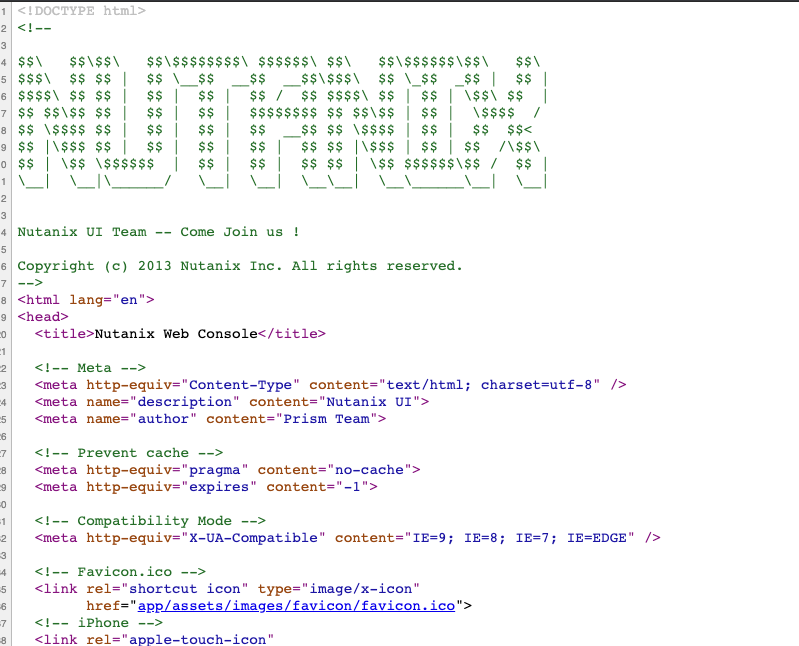
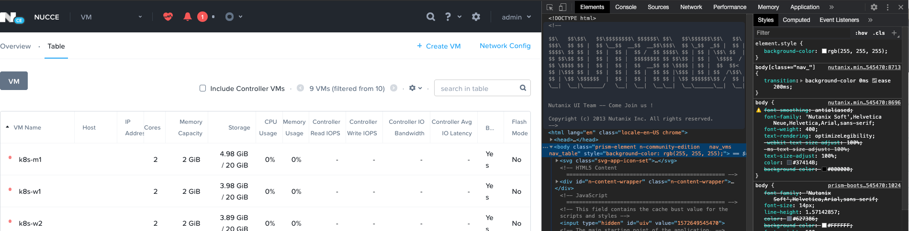
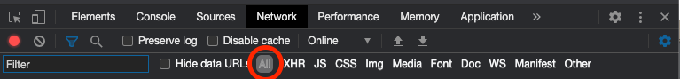
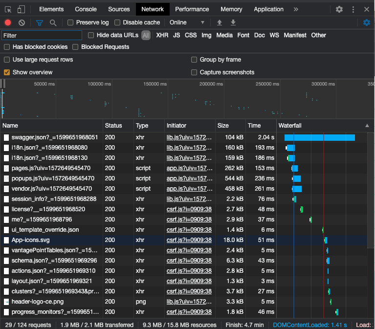
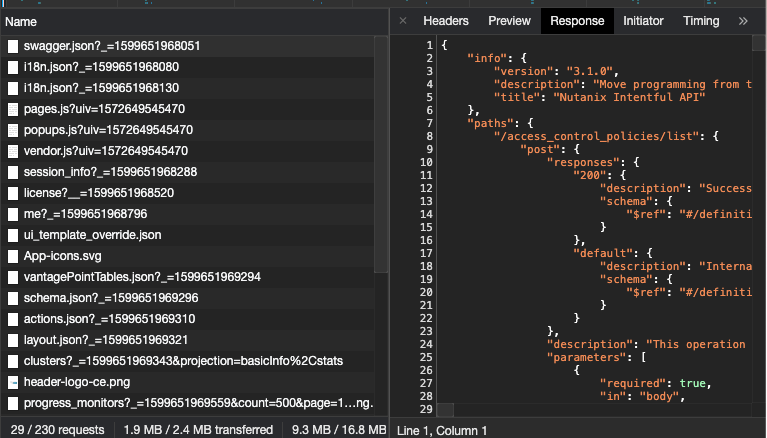
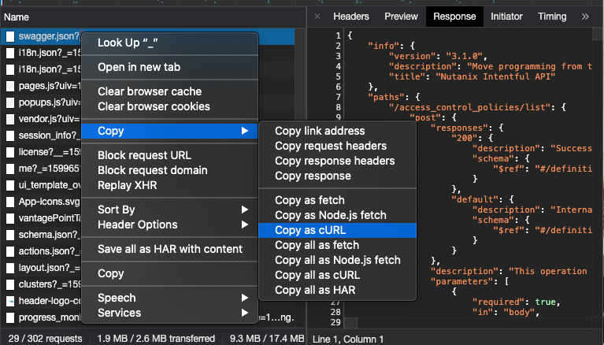
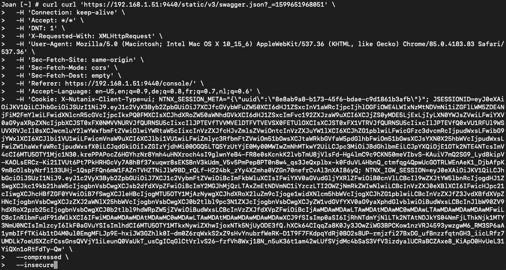
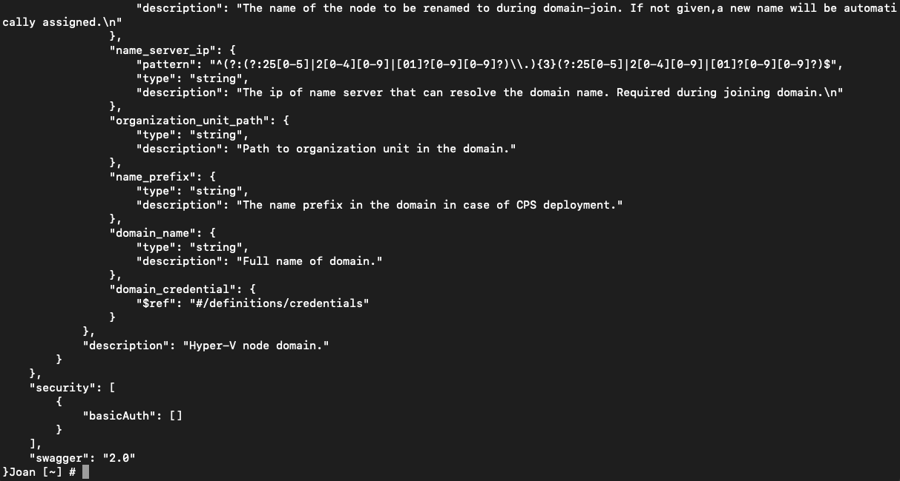

.. _day1:

-------------
Day 1 - Pre start research
-------------

Overview
^^^^^^^^

Joan is very happy to get the automation project running and is starting a research using the internet to get some answers to her following questions:

#. How can I automate Nutanix configurations?
#. What are REST API calls?
#. How do I see the API calls that are being made and their responses by the system?
#. What possibilities do I have using native browsers?
#. Do I need extra tooling for sending API calls?
#. What will I use in my project?

How can I automate Nutanix configurations?
^^^^^^^^^^^^^^^^^^^^^^^^^^^^^^^^^^^^^^^^^^

Joan searched the internet and found that there are some PowerShell scripts and CLI commands available to automate settings. “Hmmmm al great, but I don’t want to use PowerShell or CLI as that limits me in my options with respect to the O/S I can run and even on the programming language...”. So she searches on and find an article that is telling that the PRISM interface has an API explorer that can be used to configure and manipulate a configuration including the items Networking and VMs. She opens the production PRISM UI and finds the API Explorer under her name in the up right corner. She starts the API explorer and browses around. “Ok this is more like what I want to get out of the project...” Now the next question is what are API Calls and in particular REST API Calls...”

What are REST API Calls?
^^^^^^^^^^^^^^^^^^^^^^^^

Joan browses the internet and reads an article that explains API Calls. https://www.smashingmagazine.com/2018/01/understanding-using-rest-api/ From that page she understood that REST API Calls (API Calls from now on) are nothing more than Application Programming Interfaces over HTML (HTTP or HTTPS). Well that was easy. So in other words it is a way to send a request and get a response. The API Calls can be GET, PUT, POST, DELETE, PATCH and each have their own use case based on the task that is requested from the server side (https://medium.com/@9cv9official/what-are-get-post-put-patch-delete-a-walkthrough-with-javascripts-fetch-api-17be31755d28#:~:text=GET%2C%20POST%2C%20PUT%2C%20PATCH%2C%20and%20DELETE%20are%20the,sending%20data%20to%20a%20server.&text=We'll%20also%20get%20our,for%20making%20requests%20to%20servers.)

What do I need to get the API calls?
^^^^^^^^^^^^^^^^^^^^^^^^^^^^^^^^^^^^
Now that Joan understands the concepts of API Calls for automation, she is asking herself how could I reverse Engineer what the PRISM UI is doing when I make changes like creation of Networks, VMs, update to settings, etc.? She searches again the internet and finds that it is possible to see the source code of webpages using browsers (https://neilpatel.com/blog/how-to-read-source-code/). As she is trying Chrome as her favorite browser, she tries that against the PRISM UI Home screen and she is seeing just plain simple HTML.

“Hmmm not what I need... I want to see the requests and responses including the methods of the API calls. How do I get those?”. Searching some more she came across an article that described, per browser, how to enable Developer Tools (https://balsamiq.com/support/faqs/browserconsole/#:~:text=To%20open%20the%20developer%20console,(on%20Windows%2FLinux) ). She enables it in her Chrome session and sees more info, but also a lot of options and possibilities. As she is very new to the Developer Tools in Chrome, she searches for some kind of tutorials and reads them. The list she read is below:

- https://developers.google.com/web/tools/chrome-devtools/network
- https://stackoverflow.com/questions/44838290/rest-api-testing-how-to-get-response-using-google-chrome-developer-tools
- https://egghead.io/lessons/chrome-devtools-analyze-http-requests-and-responses-with-chrome-devtools

Grabbing some API calls
^^^^^^^^^^^^^^^^^^^^^^^

As she has already started het Chrome with the Developer Tools (DevTools), she just changes the Home Page to VMs to see what the Developer Tools are showing. 

“Eeeeehh that is the same as the Show Page Source...”. She looks further in the developer tools and sees that there are “tabs” available.

She clicks on the Network tab and selects **All** 

And Voila… Here are the calls that are being made by what she selected….

Joan is now curious where she can find the responses from those calls. She clicks on one of the lines in the DevTools and sees that the right side of her screen changes. On that side of the screen she sees the text Response and clicks on it… “Ha that was easy…”

She sees the response the server side has provided on her change to VMs in the context menu.

Sending API calls
^^^^^^^^^^^^^^^^^

Now that sees has the possibility to see what is being requested from the browser she wants to understand how she can send API Calls to the environment. She reads an article that explains that the DevTools can be used to copy the API Call and paste it into the curl command to simulate the request. She grabs the swagger.json line and right clicks the line and selects **Copy -> Copy as cURL**. She opens the Terminal session (she is running a Mac) and pastes the copied line. 

.. note:: 
  REMARK: For Windows machines, curl is an alias and can be used as well.

The environment returns a lot of information as a response to the request she send via the cURL command.

Tooling for API Calls
^^^^^^^^^^^^^^^^^^^^^
Joan is happy that she has a way of grabbing and sending API calls, but is not entirely happy. Terminal is a great thing, very flexible, but I’d rather have something more sophisticated. Aren’t there any tools that I can use out there? She searches the internet and finds a few article on this topic.

- https://zapier.com/engineering/api-request-tools/
- https://www.moesif.com/blog/technical/api-tools/The-Best-Free-REST-API-Debugging-Tools-For-Developing-APIs/
- https://www.guru99.com/top-6-api-testing-tool.html

------

**Result:** Joan is going to use Postman to get better debug, capture and send API calls. Also the capture is important. The possibility of sharing the grabbed/created APIs is great. It seems to be exactly what she needs, Postman is free of charge, easy to use and cross platform and seems to be able to grab APIs and save them for further analyses using Chrome with an extension.
