.. _day2:

-------------------------
Day 2 - Start the project
-------------------------

As Joan is not happy to test against the production Nutanix Cluster, she is going to use a Development environment. There are a few option for her to proceed:

- Use of Clusters in AWS to get a quick cluster started
- Use of another solution, Nutanix CE

Build the test environment
^^^^^^^^^^^^^^^^^^^^^^^^^^

As the project should be as cheap as possible with respect to costs she decides to use the following:

#. A Nutanix CE installation as this is for free and simulates a “normal” production cluster. She also doesn’t want to hassle the production system when she makes a mistake and kills the configuration or cluster. That would be bad for business.
#. Install Postman for the API Calls
#. Get the Chrome DevTools open and configured
#. Install the Postman Interceptor Extension for capturing data from the browser
#. Install the Postman Interceptor Bridge to make the capturing work on a Mac

Nutanix CE environment
^^^^^^^^^^^^^^^^^^^^^^
Joan has found many articles on the internet to set up Nutanix CE on physical or Virtual hardware based on ESXi 6.7. As she has some hardware, she decides to run the CE on the supported physical hardware. The installation was successful and she was able to login to the PRISM CE interface. Next step Postman.

Installation and configuration of Postman and the Companion apps
^^^^^^^^^^^^^^^^^^^^^^^^^^^^^^^^^^^^^^^^^^^^^^^^^^^^^^^^^^^^^^^^

Joan downloaded Postman from https://www.postman.com/downloads/ and installed the Mac version. She opened the application and launched the application. She created an account so she would be able to use the application. This also provides her the possibility to store her API calls for later use...

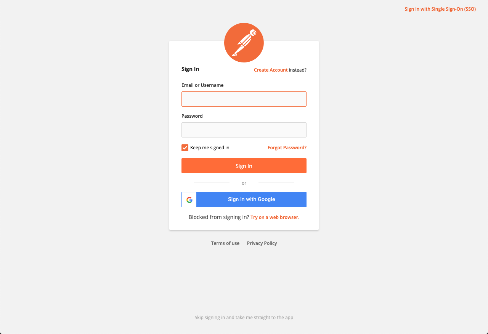

She made some changes to the configuration of Postman. The most important one was that she disbaled SSL Certificate verification under the General settings. As the Nutanix CE environments mostly have self-certified certificates, Postman needs to know this or errors will be thrown when sending API requests to the Environment.

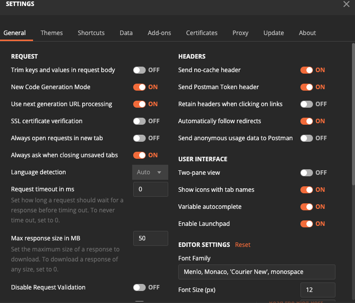

Now that Postman has been installed, Joan follows this guide to get the companion apps/extensions installed so she can grab more requests directly into Postman from her browser https://learning.postman.com/docs/sending-requests/capturing-request-data/interceptor/.
After the installation of the Interceptor Bridge she opens the Postman Interceptor and sees that the Interceptor is showing Connected.

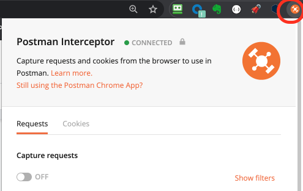

Grab first calls using Postman
^^^^^^^^^^^^^^^^^^^^^^^^^^^^^^
Joan ticks the Requests Capture requests to On and does the same for the Cookies tab.
Instantly in Postman the requests of all tabs in chrome are pouring in...

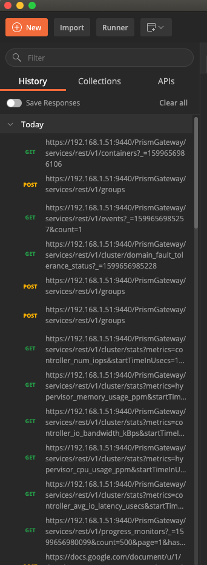

“So that seems to work perfectly...”. She sees the IP address that is providing the requests and is recognising the **192.168.1.51** IP address as being that of the Nutanix Production PRiSM interface she logged into earlier. She disables the capturing in the Requests and Cookies section of the Chrome Postman Interceptor extension. That way no more calls are being grabbed in Postman.

The DevTools has more lines. She has forgotten to close that page. “Now the main question is, if I need to use DevTools, or can I use JUST Postman?”. Looking at Postman she doesn’t see any responses that have been returned from the requests.... “Hmmm so I see the requests, but no responses. Well that is a bit disappointing... But it’s better than using a terminal session to be honest... So I need them both. Fine, but the DevTools screen on the right side of Chrome is not the easiest, wonder if that can be changed...”. Joan clicks on the **THREE DOTS** icon in the DevTools and sees that it is possible to change the location of the DevTools. There is even a possibility to have it as a separate window. 

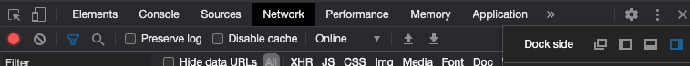

She clicks on the icon and sees that the DevTools are “disconnected” from the Chrome screen as a normal application window.

Checking the possibilities of the buttons in DevTools
^^^^^^^^^^^^^^^^^^^^^^^^^^^^^^^^^^^^^^^^^^^^^^^^^^^^^
Joan is still getting used to the DevTools and wants to start with a clean slate. Hovering over the icons to the left side of the DevTool, the Red Icon and the stop sign, it tells her that the Red Icon is to stop the capture of the webpage, and the stop button to clear all. 

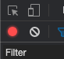

She clicks the Stop button and her screen is empty for a few seconds before the requests start pouring in again... She clicks the Red Icon, that now turned Gray, and the stop button to have a clear screen. He reenters her login credentials and sees that the DevTools isn’t showing any new lines even though PRISM is returning information...After clicking the Gray Icon she sees requests pouring in again.

Using Postman to send API requests
^^^^^^^^^^^^^^^^^^^^^^^^^^^^^^^^^^

Joan closes the DevTools window.. She also changes to start using her Nutanix CE environment now as she is about to manipulate the cluster and doesn’t want to interfere with the production environment. Her CE is running at 192.168.1.42. She start the PRISM interface and at the same time opens the DevTools. As this was in the earlier session a separate screen DevTools opens as a separate screen again. By default DevTools has a clear screen and capturing is activated.
She logs into her CE environment and sees information pouring into DevTools with the know IP address of 192.168.1.42 as the address of the requests and responses.

In the DevTools the first line she sees that the username and password are mentioned in the sending.

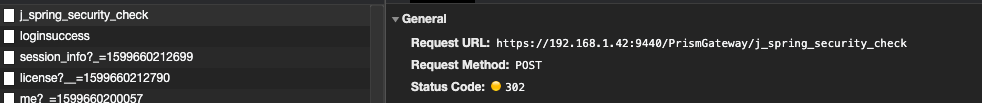

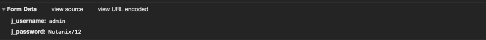

She heads over to Postman and uses the URL and the Method (POST) to create an API call and hits send. She expects to get the same reply as what has been shown in DevTools... The server replies with Success and has provided two Cookies.

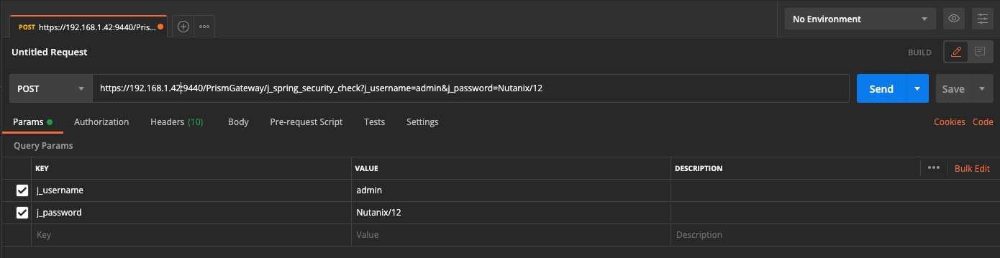

As Postman stores the cookies it received by default and Nutanix authentication can be run using Cookies (https://next.nutanix.com/api-31/rest-api-get-a-session-token-31330), after this command and the Cookie being saved, Joan should be able to run all next API commands without the need to reauthenticate. The article just mentions that the Cookie has, unless a new request is being made, a lifetime of 15 minutes.

To test this, Joan grabs one of the other requests from the DevTools that has a GET command to see if that is true using Postman... She creates a new Tab using the **+** sign in Postman and copies the request URL and pastes it into the Field and hits the **Send **button.

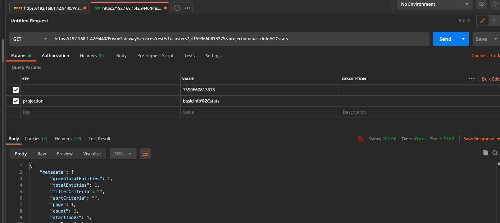

The environment replies with information. So the article is right... 
She closes all tabs except the one for the login.
Another search on the internet returned this article https://portal.nutanix.com/page/documents/kbs/details?targetId=kA032000000TSakCAG where it is mentioned how the API authentication is being done in Nutanix’ environments. As she doesn;t want to end up in Cookies being invalid, she is trying the change the request she used earlier to use the Basic Auth method.

Postman and environments
^^^^^^^^^^^^^^^^^^^^^^^^

As password and user names are dependent on the environment AND are secret, she decides to create an environment in Postman. This makes it possible to use variables in part of the request. Username, password and IP address of the to be targeted environment are just some examples.
She clicks on the **Eye** icon in the top right corner, besides the No Environment text and clicks on the **Add** button to define an environment. 

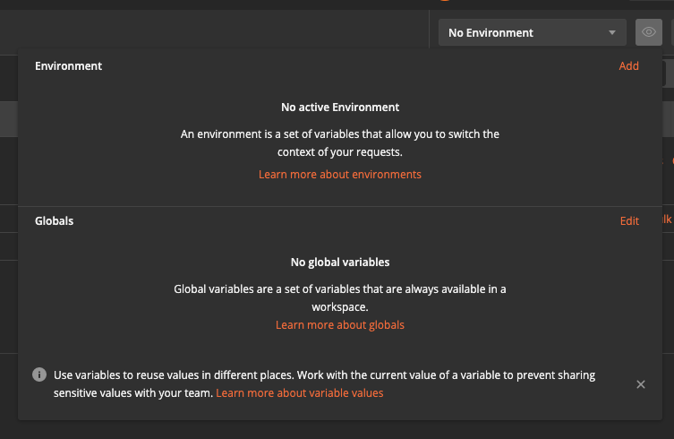

She provide the needed parameters like the following:

- username: admin
- password: Nutanix/12
- cluster: 192.168.1.42

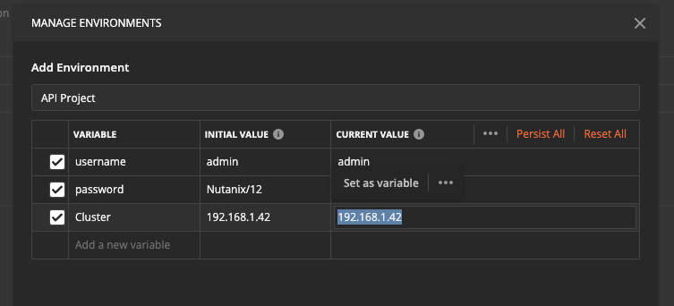

And clicks the **Add** button. She then changes the **No Environment** to **API Project**.
To use the variables set, use the **{{ VAR NAME }}** to have Postman change to the variable.

Joan closes all tabs by clicking the **X** icon on the tabs and clicks the **Don’t save** button to get to the next step. She add a new tab and starts typing **https://{{clus** and sees that Postman is providing the variable and its value.

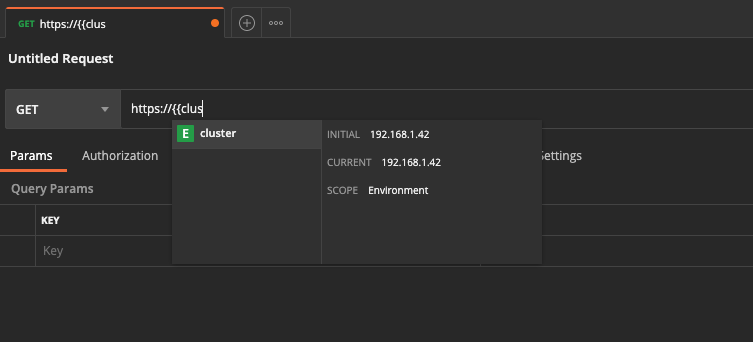

Clicks on the text and end with typing **:9440**. She then grabs a URL she sees in the DevTools and grabs everything after the **9440** and pastes that into Postman and removes all parameters.

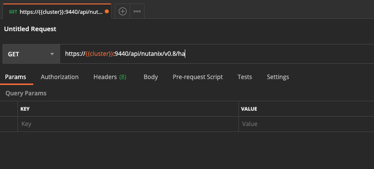

She then opens the Authorization tab and selects Basic Auth as the authentication method and provides the two fields. For the authentication, Username and Password, and changes them into resp.  **{{username}}** and **{{password}}**.

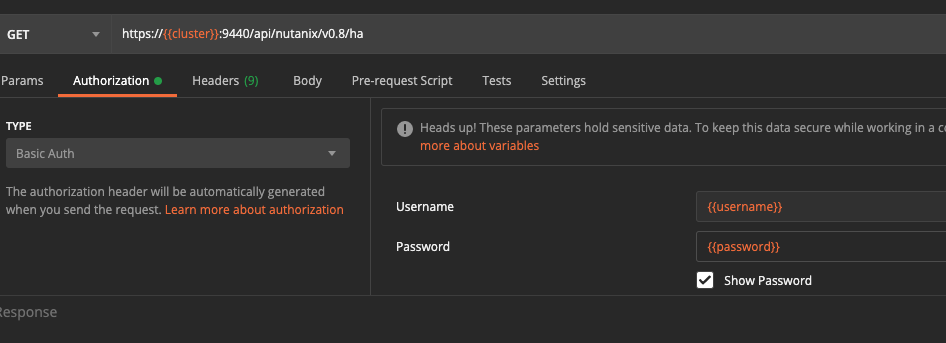

She hits the **Send** button to see if she gets a reply from the environment. Yes the cluster has accepted the authentication, so all good....

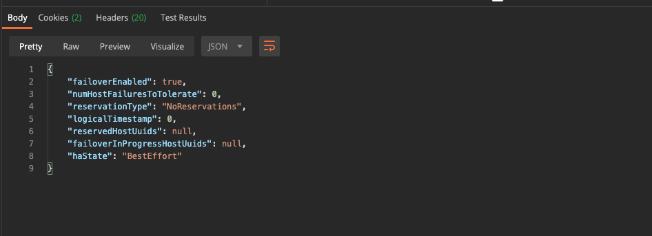

Ok now let’s get to the real stuff....

Use the API Explorer
^^^^^^^^^^^^^^^^^^^^

Now Joan’s got variables and some other stuff sorted for Postman and all seem to work, she wants to see if the items shown in the API explorer can also be used. She opens the API Explorer on her Nutanix CE and searches the VMs section. Opens the GET /vms/ part and clicks the Try it Out! Button. The Explorer returns information as expected. 

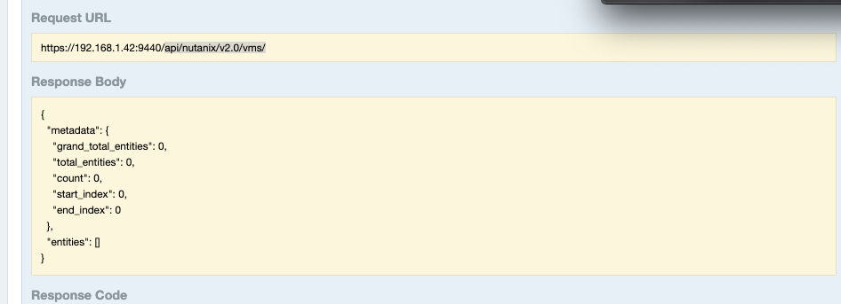

She copies the **Request URL** (not the https://IP ADDRESS:9440) and pastes it into Postman.

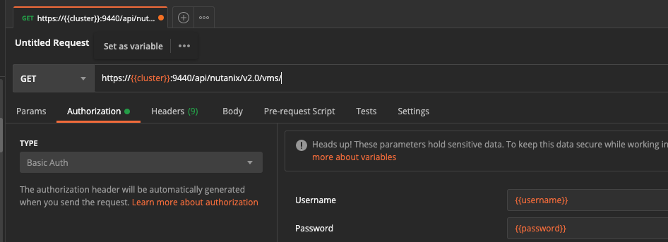

She expects to get the same information as she shaw in the API Explorer, but now in Postman. She hits the **Send** button and behold, the same information! 

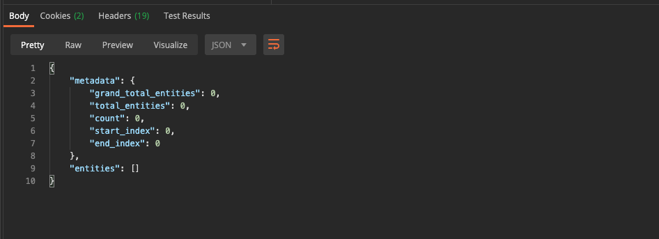

The API Explorer has also a part to create VMs, but it is not very clear what needs to be set.... “Hmm how can I understand that easier? And I have the same for networks...” she thinks.

Well let’s do that tomorrow, I think I have what I need to start the real tests wrt automation using APIs...
