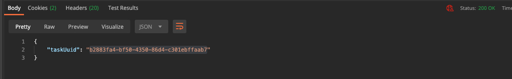

.. _day3:

---------------------------
Day 3 - Get the needed APIs
---------------------------

Joan has set herself for today two tasks.

#. Create a network using an API Call
#. Create a VM using an API Call

Based on the information from yesterday, she has a good idea how she is going to proceed. She is going to use DevTools and just click and run the steps in the PRISM interface, see what has been captured and reverse engineer it using Postman

Capture the network creation
^^^^^^^^^^^^^^^^^^^^^^^^^^^^

Joan opens DevTools and selects the VM section in PRISM (after a login) and clicks the Network Config button. DevTools is still showing more and more lines, but that is not important right now. She clicks the Create Network button and starts defining the network including IPAM. She is using information that is not being used in her environment and can find the information easy when she needs to identify the request in DevTools. 

- Network Name: Test-Network
- Vlan: 111
- IPAM Enabled: Yes
- Network Ip address / Prefix Length: 10.10.10.0/24
- Gateway IP Address: 10.10.10.254
- DNS Servers: 8.8.8.8,8.8.4.4
- Domain Search: api-proj.local
- Domain Name: api-proj.local
- Pool: 10.10.10.100 til 10.10.10.200

After she has populated the needed fields, she opens DevTools and clicks the **Stop** sign so she has a clear screen.

She then clicks the **Save** button and sees information flowing into the DevTools... After PRISM shows her the network she stops the capturing using the Red Icon in DevTools.

DevTools shows her a URL request that is related to the creation of the network and has a POST method.

All the way to the end she sees the data that has been sent to the environment as json. She clicks on **view source** to see the raw data.

She grabs the URL, after the 9440 from the URL and posts it in Postman in a new tab. Then she copies the raw data and opens Postman again. In Postman she changes the GET in POST and selects the Body tab. Here she selects raw and changes text into JSON. She then pasts the raw data in the text field below the body and cleans the json up a bit so it is easier to read.

She changes a few parameters so the new network can be created.

- name: API-Proj
- vlanId: 222
- networkAddress: 10.10.100.0
- defaultGateway: 10.10.100.254
- range: 10.10.100.100 10.10.100.200

And hits the Send button. The request returns an error message stating that **An Authentication object was not found in the SecurityContext**. 

She clicks on the Authorization Tab and sees that there is nothing set. She makes the needed changes using **Basic Auth** and the two earlier created variables **{{username}}** and **{{password}}** in the username and password fields and hits the **Send** button again. Now the environment returns a network uuid. 

“Yes, so that means that the environment has created a new network called API-Proj and uses vlan 222. Let’s see in PRISM.... YES!!!!!! That worked....”

“Ok so now I know how to create networks!! Just one thing... Why is this an old API call? I want all as high as possible... I have seen something on the API Explorer, maybe I can reverse some parts to get the API V2 and not the old v0.8 API call...”. 

Joan opens the REST API Explorer on her Nutanix CE environment and grabs the API v2 **/networks/ -> GET** and hits the **Try it out!** Button. From the results pane she copies the Request URL everything after the :9440

In Postman she right clicks the tab she has just used for the creation of the network and selects **Duplicate Tab**. That way she doesn’t have to retype the Authentication. 

In the new tab she pastes the part of the URL she copied from the API Explorer, Changes the **POST** into **GET** and cleans the Body part to see what the reply is from the environment. 

After she hits the **Send** button the environment is returning with the same information she saw in the REST API Explorer. The system is providing a JSON based file where the fields are mentioned that need to be set in the v2 API call to create a network under the v2 API calls.
Back at the API Explorer, she opens the POST /networks/ part and clicks on the text under the Model schema text field and copies the text from the body part in the API Explorer.

 In a new Duplicated Tab under the Body part in Postman she pastes the text and makes some changes..

- GET -> POST method change,
- Changes fields in the copied data to the following.

  .. code-block:: json

    {
      "annotation": "API Calls Project",
      "ip_config": {
        "default_gateway": "10.10.200.254",
        "dhcp_options": {
          "domain_name": "api-call-proj.local",
          "domain_name_servers": "8.8.8.8",
          "domain_search": "api-call-proj.local"
        },
        "dhcp_server_address": "10.10.200.253",
        "network_address": "10.10.200.0",
        "pool": [
          {
            "range": "10.10.200.100 10.10.200.200"
          }
        ],
        "prefix_length": 24
      },
      "logical_timestamp": 0,
      "name": "api-call-proj",
      "vlan_id": 333
    }

This should create a new network called api-call-proj and run at Vlan 333 
She hits the **Send** button and waits what the environment returns. The environment returned a **network_uuid** so that would mean it has a new network created using the v2 API calls? She opens PRISM UI and the new network has been created!

Ok now she also knows how she can use the data returned from the GET method and use that into a JSON for the POST method.

Network done!, now how to create VMs....

Creating VMs
^^^^^^^^^^^^

Before she can create a VM, she needs to upload ISO and/or Disk images. Using the method as with creating a network, Joan is opening DevTools and heads over to the Image configuration part in PRISM. 

Uploading images
****************

Joan has the DevTools open and uploads a file using her machine. 

She sees that DevTools is showing her multiple requests that together form the upload of the file. The upload flow is as follows:

#. A request is made to have a file uploaded. This creates a task UUID
#. The TASK UUID is used to get the progress and status of the task as well as getting the UUID of the image
#. A batch request that makes it possible to upload the data
#. An upload request where the UUID of the image is part of the URL. This is the physical upload of the file...

“Ok so it can be done, but is not the easiest way of uploading ISO and Disk images...”. Joan knows that most if not all, needed images are on a file server in her organisation that also supports web traffic to the same images. She deletes the file she uploaded by clicking the **X** sign in the **Image Configuration** part in PRISM and click the **OK** button to accept the deletion. She then clicks the **Upload image** button and provides the information requested and type the URL where the image is that needs to be uploaded. 

Just before she clicks the **Save** button she clears the DevTools interface using the **Stop** sign. Then she hits the **Save** button to capture the request. After the image has been uploaded, she hits the **Red icon** in DevTools to stop the capturing.
 
The request is made and captured in a v0.8 version of the API. Again the old version, but let’s see if we can use that in Postman. She grabs the API part of the URL (everything after **:9440**) and pastes that in a duplicated tab in Postman in the URL section. From the DevTools, she grabs the Request payload, in view source, and pastes that in the body part of the tab in Postman and cleans up the JSON so it is easier to read.

To make sure the command works, she deletes the image from PRISM and captures the Request as well...”You can never know when this comes to use...”.
She cleans the DevTools again and starts the capturing by clicking on the **Gray Icon**. Hits the **X** icon and the **OK** button to get the request in the DevTools.

Now that the image has been deleted in PRISM, she hits the **Send** button in Postman to see what the result would be. The environment returns a task id, so it seems that the request has been accepted. 

In the API Explorer she sees that there is a possibility to get the status of the task by using **GET /tasks/{uuid}**. As she want to see what it means, she runs that with the **uuid** of the return of the request to upload an image. In the API  Explorer, she copies the UUID from the Postman Send command and waits for what comes back.

Some of the last lines in the Response Body show **Succeeded** as the **progress_status**. This means that the request made in Postman has been ok and the image should be available to be used in the VM Creation. After checking PRISM that the image is there, she copies the Request URL API part and pastes that in a new duplicated Tab in Postman and changes the method from POST to GET and runs the API call by clicking the **Send** button. The result is the same as the API Explorer. 

Now that these steps work, she analyses the request API call a bit more.... In the JSON Request Payload there is a line that states **"containerUuid":"9c5b8994-b636-48cb-8817-bbe8a7f2eca5"**. To get the UUID of the storage container, she goes into the API Explorer to see if there is an API all that return the UUIDs of the storage containers. The answer is yes it exists. Now she does read the possibilities and sees that there is a way to filter the data returned/searched for. In the search_string she types default and hits the **Try it out!** Button in the API Explorer. 

“So ok, there is information returned, but as there is only one storage container, not sure if it worked.... Let’s create quickly an extra storage container, call it Images and search for just that container using the filter mechanism we just tested...”. After the creation of the storage container, using the default settings, she jumps back to the API Explorer and reruns the request, but changed the **search_string** to **Images**. The search filter works... Only the Images container is being returned including all needed information.

.. figure:: images/24.png

“Ok now I can use that to get the images in the correct container.... Let’s change the Postman API Call so it uses the Images container and not the default one...”. She deletes the Image in PRISM and makes the change in the Postman tab so the containerUuid line is using her just created Storage container uuid.

.. code-block:: json

  {
    "name":"Ubuntu 18.04.2 LTS",
    "annotation":"Ubuntu 18.04.2 LTS",
    "imageType":"ISO_IMAGE",
    "imageImportSpec":{
        "containerUuid":"0c48857b-aa38-42a1-99c5-eea65f7a21c3",
        "url":"http://192.168.1.63/images/ubuntu-18.04.2-live-server-amd64.iso"
    }
}

The environment returns the UUID of the task. 

She grabs that UUID and uses the tab where she tested the request of the task to get the details. She sees that the value of **percentage_complete** is increasing... 

No she knows how to get the container UUID, she set another task for herself that might also be interesting to automate. The creation of a storage container.

Creation a storage container
^^^^^^^^^^^^^^^^^^^^^^^^^^^^

Joan opens the Storage menu in her CE environment and sets all options, even though they will lead to an error message due to the limitations of one node solutions. At least she will see all the keys and values pairs in the JSON. She opens DevTools and hits the **Save** button in PRISM to capture the request. DevTools, as expected throw a red text for the container creation (error 500), but she has the key value pairs... 

Also the URL is being shown....
https://192.168.1.42:9440/PrismGateway/services/rest/v1/containers for the URL and the JSON looks like:

.. code-block:: json

  {
   "id":null,
   "name":"api-proj",
   "storagePoolId":"0005aeb5-b589-f44b-6651-001fc69c8a29::3",
   "totalExplicitReservedCapacity":0,
   "advertisedCapacity":107374182400,
   "compressionEnabled":true,
   "compressionDelayInSecs":0,
   "erasureCode":"ON",
   "fingerPrintOnWrite":"ON",
   "onDiskDedup":"POST_PROCESS",
   "nfsWhitelist":["10.10.10.0/24"],
   "preferHigherECFaultDomain":true
  }

The API call is a version 1 call and Joan looks in the API Explorer if there is a v2 equivalent for the storage container creation. And there is one... Looking at the needed information for the v2 API Call, she tried to get the **GET storage_containers** to see if she can reverse engineer what those parameters need to be. She pastes the body text, after clicking on the Model on the right hand side in the **POST /storage_containers/** part in the API Explorer, into a new duplicated tab in postman in the body part. She then changes the **GET -> POST** and starts to make changes to the JSON Payload to the parameters she understands..

She hits the **Send** button to see what the environment replies with... Well she got some error messages. The first one is about replication factor. As she is running on a one node CE environment, she removes the lines that have something to do with that and resends the API call... Then she gets a message on Encryption not enabled, so she also removes that line using the **Send** button. Now the system replies with 

.. code-block:: json

  { “value”: true }

“Hmmm that would mean there is now a storage container created with the name api-proj-api-call. Let’s see.... Yes it is there!!”

Now that she capable, by using APIs calls, of:

- Create networks
- Create storage containers
- Get storage containers, including search filter
- Upload images using a webserver

She heads out to the next phase, creating a VM.

Creating VMs
^^^^^^^^^^^^

For now she wants to use ready created disk images for this test. Installation ISO for Windows and Linux, using resp. Sysprep unattend.xml and CloudInit are for now out of the scope, she heads out onto the internet and searches for pre-built images of Ubuntu. A quick search led her to OpenStack where a full list of available images can be found (https://docs.openstack.org/image-guide/obtain-images.html). She is going to use an API Call she ran earlier to upload the image of Ubuntu Bionic (18.0.4 LTS) using the URL from the image. 
The earlier used API CAll to upload the Ubuntu ISO image is using the 0.8 version of the API. Joan decides to upgrade that to v2. She looks at the API Explorer and changes the Requests JSON Payload, from the v0.8 API Call, so it uses the correct keys. She duplicates a tab to a new one and in the Body she pastes the following information: 

.. code-block:: json

  {
    "name":"Ubuntu 18.04.2 LTS-Disk",
    "annotation":"Ubuntu 18.04.2 LTS-Disk",
    "image_type":"DISK_IMAGE",
    "image_import_spec":{
        "storage_container_name":"Images",
        "url":"https://cloud-images.ubuntu.com/bionic/20200908/bionic-server-cloudimg-amd64.img"
    }
  }

She hits **Send** and the environment is replying with a UUID for a task. Using the earlier **GET task** API Call, she resends the request over and over till the environment replies with Succeeded, she is not returning to PRISM to see if the image is there, in instead she uses an API call she saw in the API explorer to get the information of the images at the system. In the tab she used to upload the img file, using the URL, she changes the **POST -> GET** and hits **Send**.  She sees that there are two images, that is correct, and both are ACTIVE as their img_state. So all good.

Finally ready to get the VM creation captured...

In PRISM she creates a new VM where she uses the Ubuntu Disk image (Clone from Image Services), the created network and stores its data in the Images storage container. Before she hits the **Save** button she clears DevTools and makes sure it captures the requests. After the VM is created in PRISM she stops the capturing. She analyses the requests being send:

- A request to see if the VM, with the name she provided, exists if not,
- A request that sends the information to create the VM with the provided settings.

She grabs the payload from the second command in DevTools, duplicates the tab in Postman and copies the Payload in the Body part of the new tab and changes the URL to what was mentioned in DevTools. Then she makes the payload a bit more human readable. She decides to delete the VM from the PRISM interface and runs the API Calls to see if that would lead to the same result. A VM. Yes, the result is exactly the same. Now let’s see what I can strip from the Payload to still have a valid VM creation. In the originating Payload, there is a UUID with respect to a disk she can never ever guess. So she starts with stirpping that from the Payload. She deletes the VM from PRISM and reruns the API Call from Postman. That was allowed.... There is A VM Again. Now she changes a few more keys in the Payload:

#. name: Test-API
#. description: Test-API
#. minimum_size: remove that line including the comma one line higher so the Payload JSON is correct
#. requested_ip_address: remove the line

And hits **Send** again... Still all good... Interestingly enough, the latest VM has received an IP address from the define DHCP pool in the network.
Now she deletes the two lines that have the keys **hypervisor_type** and **vm_features** and changes the name and the description to Test-API1. After hitting the **Send** button the VM is created as defined in the Payload.

The Payload has two uuids. One for the Disk the VM clones from and the other from the Network she created earlier. As she already is able to grab those using API calls she should have no everything to get to the next phase. Putting it all together in a scripted manner.

Now lets save the Tabs in a Collection so I can reuse them when needed.

Create Collections in Postman
^^^^^^^^^^^^^^^^^^^^^^^^^^^^^

In Postman she clicks on the left hand side of the screen On Collections and selects **New collection**. She names the new Collection API-Project and clicks on **Create**. 

She saves all the open used Tabs in Postman by clicking on the Save button on the right hand side next to the **Send** button she has been using often today. Each Tab gets their own description based on the API Calls purpose. She needs to make sure that she has selected the API-Project Collection on the bottom area of the screen...

And clicks **Save to API-Project**. To keep the overview, after she has saved the Tab, she closes it to keep an overview. For the API Calls of version 0.8 she added v0.8 so she knows these are the “old” versions of the API... Her Collection looks like this...

“That’s it for today... I’m done. Tomorrow I’ll be putting everything together in a script...” and closes all off and heads home..
