.. _day4:

----------------------------------------
Day 4 - Putting all together in a script
----------------------------------------

Today is the day where Joan will put everything together in a script. As she has no real expertise in a programming language except Bash, she decides to use that language to create the script. The script should be able to do the following as set by her organisation:

#. Create a Storage Container
#. Create a network
#. Upload Images
#. Create VMs that use the images, the storage container and the network created earlier

Research on Bash and JSON data
^^^^^^^^^^^^^^^^^^^^^^^^^^^^^^
During the project so far, Joan has seen a lot of JSON Payloads being shipped and received. As her language of choice is Bash, she want to find out how she can use bash in combination with JSON. “As I need to get just some values from keys, and not the full JSON, how can I query JSON? That is the biggest issue I see now... Let's search the internet. I can not believe I’m the only one that has that challenge...”. Searching the internet on bash json gave a great article. https://cameronnokes.com/blog/working-with-json-in-bash-using-jq/ . In this article is explained how Bash can work with JSON using a tool called jq. So she installs jq on her machine. The article is also using curl to get requests in and out an URL. Also very helpful. 
So she needs jq and curl and off course the Bash logic to create a script....

Preparation for the script
^^^^^^^^^^^^^^^^^^^^^^^^^^

John, a co-worker of hers, has been running some projects on Docker and Kubernetes and is very happy with using Visual Code. So she installs Visual Code as well (https://code.visualstudio.com/download). Besides that she also installs some extra extensions so she has a bit more guidance when she is coding...

- Bash Beautify
- shellman
- tl;dr pages
- Gitlens
- Githistory

As Joan is going to start coding, she wants to be able to store the data in a Github repo so the scripts are saved if her testing environment and/or laptop breaks. So she sets up a GitHub account and uses Github Desktop (https://desktop.github.com/) for the initial push and pull of the data. After the installation she creates a repo on github and calls it api-project and uses GitHub Desktop to clone the repo. The location of the clone is **~/github/api-project**.

Starting the bash script
^^^^^^^^^^^^^^^^^^^^^^^^

She opens the location in Visual Code (VC) via **File -> Open..** and sees that the repo has some information already.

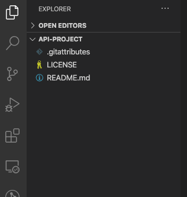

In VC she clicks on the **New file button** (next to the API-Project folder when she hovers over it) 

and names it **automation.sh**.

The first lines she typed are:

.. code-block:: bash

    #!/bin/bash

    # Script for automating a few steps in Nutanix
    # 1. Create a storage container
    # 2. Create a network
    # 3. Upload images using an URL
    # 4. Create a VM using the earlier created/uploaded items

    # Variables
    nutanix_ip="192.168.1.42"
    username="admin"
    password="Nutanix/12"

    # Get the storage containers on the system
    curl https://${nutanix_ip}:9440/PrismGateway/services/rest/v2.0/storage_containers/

In VC she clicks on **Terminal -> New terminal** to open a new terminal window at the bottom of the VC screen. That way she doesn’t have to switch between interfaces....
She saves the file and runs in the terminal screen **chmod +x automation.sh** that way she can start the script from the terminal and doesn’t need to add bash in front of it.
THe script returns an error.. Something with SSL certificate... A quick search on the internet solved the issue. Just add **--insecure** in the curl line and you are all good..
So she adds a line where she creates a variable that will hold that **--insecure** and adds the variable to the curl command.

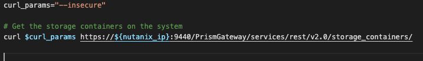

She saves the file and reruns the command. Now she gets another error which is mentioning no authentication... Another search gives her the parameter **--user <user_name>:<password>** to be added. So she adds that and reruns the command. ““Yes some JSON information!” now JQ comes into play... Reading a bit more on the curl command (https://curl.haxx.se/docs/manpage.html) she reads that **--silent** is not returning any output of the command it self like progress etc, just the return of the URL. Her Curl parameters and curl command look like this:

.. code-block:: bash

    curl_params="--insecure --silent"

    # Get the storage containers on the system
    curl $curl_params -u $username:$password https://${nutanix_ip}:9440/PrismGateway/services/rest/v2.0/storage_containers/

When she saves and reruns the command she gets a long list with json information.

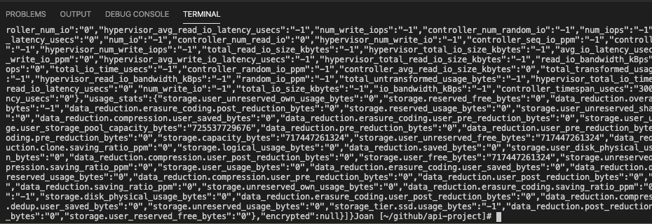

“Wow this is massive... How do I get what I need??? Could Postman help me on this? I already have the stuff in Postman as API Calls, is there a way I can “export” the API Calls?”. She opens Postman and Selects the **Get Storage Container** in her **API-Project** collection. To the left she sees the text **Code** and Clicks on it. There she clickson cURL and gets all needed commands!!!

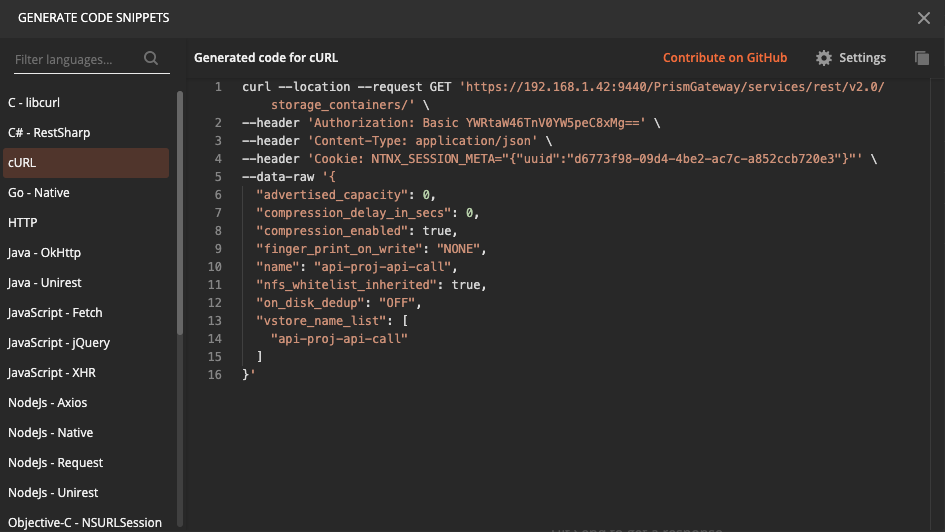

She uses the header of Content-Typer: application-json, she sees in her script. The rest is not needed for now. “Hmm that was easy...Maybe I can use that for the POST API Calls, later in the script.”.

Using the article she found on jq, https://stedolan.github.io/jq/tutorial/, she sees that using **| jq ‘.’** the output of the curl command is put through the jq command and shown in a more JSON layout. Not all on one line... 

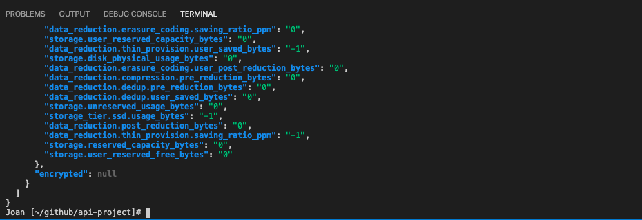

So that works... Now the filtering... Back in Postman she reruns the API Calls so she can easily navigate through the returned JSON Payload. Looking at the json and keeping the filtering in mind she changes the curl command with **jq ‘.’** in a more filtering way. She changes the **jq ‘.’** into  **jq ’.entities[].name’** a saves the file and runs the script. “Yes, just the names of the storage containers!!! Just the nasty **“** symbol at the beginning and the end of the names. She knows that she can remove them using **tr -d \”**. So she adds that the curl command in the script and voila, just the names and not the extra **“** symbols...
The curl command looks now like this:

.. code-block:: bash

    curl $curl_params -H $curl_header -u $username:$password https://${nutanix_ip}:9440/PrismGateway/services/rest/v2.0/storage_containers/ | jq '.entities[].name' | tr -d \"

Next step is to assign the shown values from the command to a bash variable. As the returned items are more than one line, Joan decides to put the results in an array.

She knows that a result of a command can be assigned to a variable using something like **var=$(<COMMAND TO RUN>)**. Now that she wants to get to an array she has to add extra () at the beginning and end of the to be run command. Something like **var=($(<COMMAND TO RUN>))** (https://www.linuxjournal.com/content/bash-arrays). She tries this and adds an extra command **echo ${#st_cntrs[@]}** to have the script print the number of items in the array. 

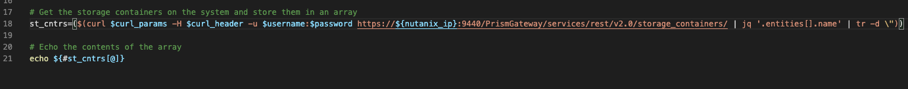

She reruns the command and sees that the array has 5 items. Exactly the same number as she ran the curl command earlier.

She repeats the steps for networks and VMs. The **jq ‘entries[].name’** doesn’t have to be changed as she figured out using Postman that the API calls return the roughly same tree of information. Now she has three variables that she can have echoed and checked.
She saves the file and runs it in her VC.

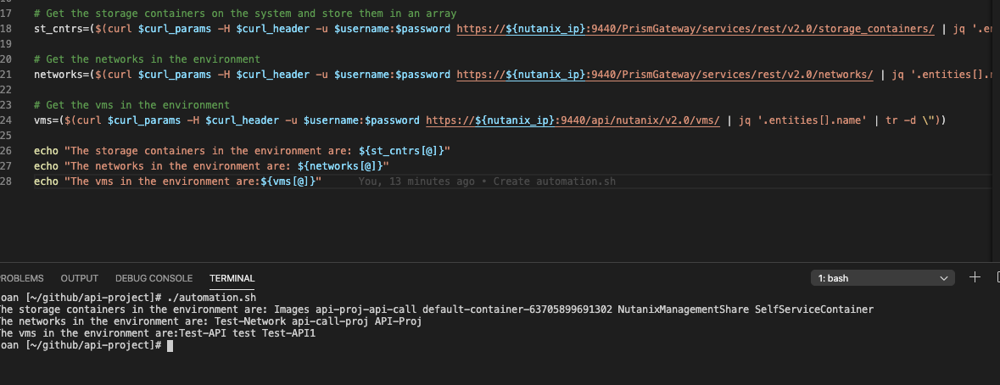

The running of the script returned that the variables are populated with the correct values in an array. As Joan needs to have some “dependencies” in her API calls, network, StorageContainer, she needs to have these before she can upload images, create networks and VMs.

Next part.... Delete all she has created to capture the API Calls.

Cleaning the environment
^^^^^^^^^^^^^^^^^^^^^^^^

In PRISM, Joan makes sure she deleted all the networks, storage containers and VMs she had created earlier.
To do this she is using the **acli** and **ncli** command line interface (ease of use). That way she doesn’t have to grab the delete API calls. She runs the following commands:

#. Login to the CVM using **ssh nutanix@192.168.1.42**
#. **acli vm.list** to get the list of VMs on the cluster
#. **acli vm.delete [Tt]*** to delete the earlier created VMs
#. **acli net.list** to get the list of earlier created networks
#. **acli net.delete <NETWORK NAME>** to delete the network and repeats this step for all networks she created earlier.
#. **acli image.list** to get the list of Images that have been uploaded in the cluster
#. **acli image.delete <IMAGE_NAME>** to have the images deleted. Joan uses acli image.delete Ubuntu* to have all Ubuntu images deleted.
#. **ncli container rm name=<CONTAINER_NAME> ignore-small-files=true** to delete the storage container. For the Images container she runs into an issue that the system can not delete the container as it holds file that were not marked for removal. She followed the article at https://portal.nutanix.com/page/documents/kbs/details?targetId=kA032000000PMcKCAW to delete all the files in the container and rerun the command for the Images container. She reruns the command not now all good. For the other container, she succeeded at the first run of the command.

   .. figure:: images/10.png

Now that the system is “clean” she heads back to VC to get the next steps in, creating a network using API Calls.

Creating a Network via a Curl API Call
^^^^^^^^^^^^^^^^^^^^^^^^^^^^^^^^^^^^^^

In Postman she opens her Collection and clicks on the Create Network text to have the tab on the right side of the screen.

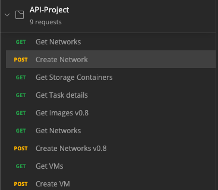

In the body part she looks to see if there are some dependencies with respect to the environments and sees none... So she clicks on **Code -> cURL** and copies the payload (**--dataraw**)

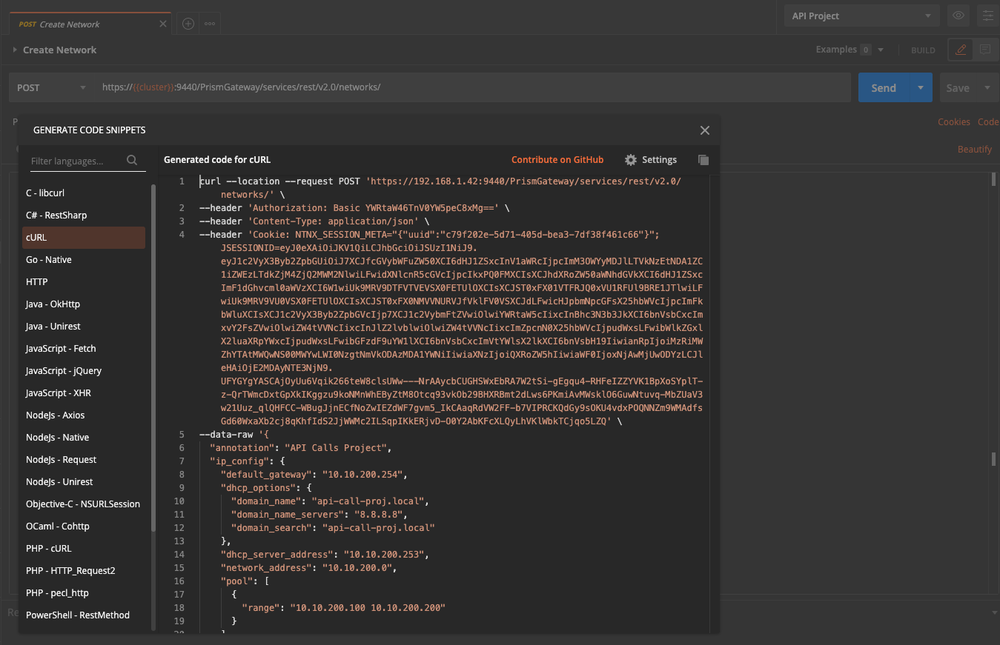

And copies that in her VC screen all the way to the end. Now that she knows the payload, she wants to assign a parameter so that she can easily change the payload and have a shorter curl command. That way she has a better overview and keep the code clean... She uses the parameter payload.
She copies the URL from the Postman tab and adds the other parameters she used earlier to create her curl command. Also she has to add the **--request POST** parameters as the CURL command is used for another method. This also means that she has to provide the payload that needs to be send to the environment. This is done using the **-d** parameter followed by the payload.  The command looks like this:

.. code-block:: bash

    curl --request POST "https://${nutanix_ip}:9440/PrismGateway/services/rest/v2.0/networks/" -d "$payload" $curl_params -H "$curl_header" -u $username:$password

She saves the file and runs it. She sees that the script returns a JSON based answer: **{“network_uuid”:”fcffc16d-56bb-4123-8875-961c8e343506”}**. By using jq again, she is able to filter on the network_uuid and return the value of the key. Then, due to the way jq works, she needs to get rid of the **“** symbols. For this she uses the **tr -d \”** command. Put all together her curl command looks like this:

.. code-block:: bash

    curl --request POST "https://${nutanix_ip}:9440/PrismGateway/services/rest/v2.0/networks/" -d "$payload" $curl_params -H "$curl_header" -u $username:$password | jq '.network_uuid' | tr -d \"

She saves the command and removes the created network in PRISM and reruns the script to see the outcome. She expects to see just a UID that corresponds with the UUID shown in PRISM. 
The script returns, as expected, a UUID and the values of the arrays.

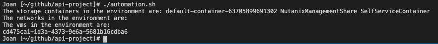

The UUID in the Terminal screen shows the exact same UUID in PRISM

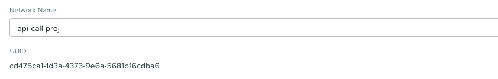

Now that that is settled the UUID needs to be assigned to a parameter so it can be used at the creation of the VM later in the script. To do this she adds a few things to the command so that the command result is being populated in a variable. To make sure she tests it, she adds an echo command that prints the variable. The new command line looks like this:

.. code-block:: bash

    net_uuid=$(curl --request POST "https://${nutanix_ip}:9440/PrismGateway/services/rest/v2.0/networks/" -d "$payload" $curl_params -H "$curl_header" -u $username:$password | jq '.network_uuid' | tr -d \")
    echo $net_uuid

As the command returns a UUID if it has created the network, it can be used to see if it ran successfully.

Creating a storage container
^^^^^^^^^^^^^^^^^^^^^^^^^^^

Next step is to create storage containers. Joan uses the same steps to create the storage container as with the creation of the network and assigns variables. She deletes the network in PRISM and  saves the script and runs it.
The script does as expected, creates the network and the Storage Container Images. 

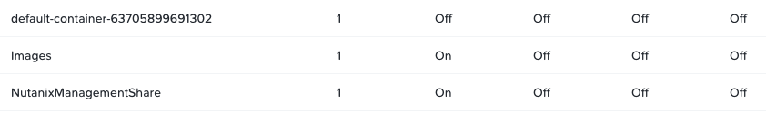

The script also returns a JSON value **{“value”:”true”}** after it has created the storage container. That can be used to check if the command has run successfully.

Upload of images
^^^^^^^^^^^^^^^^

Rerunning the same process as used before, she grabs the upload image from the Postman Collection and copies the URl and the Payload for the upload of an image where she again uses a variable for the payload that needs to be sent. Her script looks, for the image upload, like this:

.. code-block:: bash

    # Upload an image
    payload_image='{
        "name":"Ubuntu 18.04.2 LTS-Disk",
        "annotation":"Ubuntu 18.04.2 LTS-Disk",
        "image_type":"DISK_IMAGE",
        "image_import_spec":{
            "storage_container_name":"Images",
            "url":"https://cloud-images.ubuntu.com/bionic/20200908/bionic-server-cloudimg-amd64.img"
        }
    }'

    task_uuid=$(curl "https://${nutanix_ip}:9440/PrismGateway/services/rest/v2.0/images" -d "$payload_image" $curl_params -H "$curl_header" -u $username:$password | jq '.taskuuid' | tr -d \")
    echo $task_uuid

She deletes the created network and storage container and reruns the script. The script returns the values as expected, and at the last line the UUID of the task that is started for the upload of the Image...

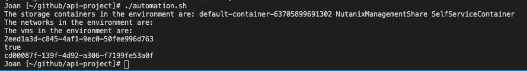

That can be used to check how far the task is. To make sure that she can start running the script, even when some parts are already created, like network, storage and Upload of the images, she adds some if then routines. Her script looks like this:

.. code-block:: bash

    #!/bin/bash

    # Script for automating a few steps in Nutanix
    # 1. Create a storage container
    # 2. Create a network
    # 3. Upload images using an URL
    # 4. Create a VM using the earlier created/uploaded items

    # Variables
    nutanix_ip="192.168.1.42"
    username="admin"
    password="Nutanix/12"

    curl_params="--insecure --silent"
    curl_header='Content-Type: application/json'

    # Get the storage containers on the system and store them in an array
    st_cntrs=($(curl $curl_params -H "$curl_header" -u $username:$password https://${nutanix_ip}:9440/PrismGateway/services/rest/v2.0/storage_containers/ | jq '.entities[].name' | tr -d \"))

    # Get the networks in the environment
    networks=($(curl $curl_params -H "$curl_header" -u $username:$password https://${nutanix_ip}:9440/PrismGateway/services/rest/v2.0/networks/ | jq '.entities[].name' | tr -d \"))

    # Get the images from the environment
    images=($(curl $curl_params -H "$curl_header" -u $username:$password https://${nutanix_ip}:9440/PrismGateway/services/rest/v2.0/images/ | jq '.entities[].name' | tr -d \"))

    # Get the vms in the environment
    vms=($(curl $curl_params -H "$curl_header" -u $username:$password https://${nutanix_ip}:9440/api/nutanix/v2.0/vms/ | jq '.entities[].name' | tr -d \"))

    echo "The storage containers in the environment are: ${st_cntrs[@]}"
    echo "The networks in the environment are: ${networks[@]}"
    echo "The vms in the environment are:${vms[@]}"
    echo "The images in the environment are: ${images[@]}"

    if [[ " ${networks[@]} " =~ " api-call-proj " ]]; then # If the network doesn't exist yet, create it
        echo "Network Already exists"
    else
        # Create network
        payload='{
        "annotation": "API Calls Project",
        "ip_config": {
            "default_gateway": "10.10.200.254",
            "dhcp_options": {
            "domain_name": "api-call-proj.local",
            "domain_name_servers": "8.8.8.8",
            "domain_search": "api-call-proj.local"
            },
            "dhcp_server_address": "10.10.200.253",
            "network_address": "10.10.200.0",
            "pool": [
            {
                "range": "10.10.200.100 10.10.200.200"
            }
            ],
            "prefix_length": 24
        },
        "logical_timestamp": 0,
        "name": "api-call-proj",
        "vlan_id": 333
        }'

        net_uuid=$(curl --request POST "https://${nutanix_ip}:9440/PrismGateway/services/rest/v2.0/networks/" -d "$payload" $curl_params -H "$curl_header" -u $username:$password | jq '.network_uuid' | tr -d \")
        echo $net_uuid
    fi

    if [[ " ${st_cntrs[@]} " =~ " Images " ]]; then # If the Images container isn't there, create it
        echo "Storage Container Already exists"
    else
        # Create storage containers
        payload_strcntr='{
        "advertised_capacity": 0,
        "compression_delay_in_secs": 0,
        "compression_enabled": true,
        "finger_print_on_write": "NONE",
        "name": "Images",
        "nfs_whitelist_inherited": true,
        "on_disk_dedup": "OFF",
        "vstore_name_list": [
            "Images"
        ]
        }'

        str_uuid=$(curl --request POST "https://${nutanix_ip}:9440/PrismGateway/services/rest/v2.0/storage_containers/" -d "$payload_strcntr" $curl_params -H "$curl_header" -u $username:$password | jq '.value')
        echo $str_uuid

    fi

    if [[ " ${images[@]} " =~ " Ubuntu 18.04.2 LTS-Disk " ]]; then # if the image isn't there, create it
        echo "Image Already exists"
    else
        # Upload an image
        payload_image='{
        "name":"Ubuntu 18.04.2 LTS-Disk",
        "annotation":"Ubuntu 18.04.2 LTS-Disk",
        "image_type":"DISK_IMAGE",
        "image_import_spec":{
            "storage_container_name":"Images",
            "url":"https://cloud-images.ubuntu.com/bionic/20200908/bionic-server-cloudimg-amd64.img"
        }
        }'

        task_uuid=$(curl --request POST "https://${nutanix_ip}:9440/PrismGateway/services/rest/v2.0/images" -d "$payload_image" $curl_params -H "$curl_header" -u $username:$password | jq '.task_uuid' | tr -d \")
        echo $task_uuid

        # Check the task progress
        progress=$(curl "https://${nutanix_ip}:9440/PrismGateway/services/rest/v2.0/tasks/$task_uuid" $curl_params -H "$curl_header" -u $username:$password | jq '.')
        echo $progress
    fi

As she now has some checks to see if the content is already in the environment she can proceed. 
Now during the last step, the upload of the images, she received a return from the cURL command. 

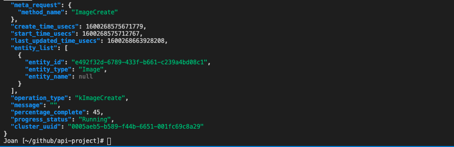

The result has some interesting keys that can be used to see the progress of an upload. The **percentage_complete** and the **progress_status**. She has seen this earlier and is now using this to wait to before proceding to the next step, create a VM. After the upload has succeeded she grabs the task UUID again and uses Postman to see what the values of the keys will be after the images has been uploaded successfully. In Postman the values have been changed to **100** for **percentage_complete** and **Succeeded** for the **progress_status**. She changes the cURL command to have these two keys being pulled via jq filtering (https://stedolan.github.io/jq/manual/). 

The jq at the end of the cURL command (jq ‘.’) is changed by her into 

.. code-block:: bash

    jq ‘. | .percentage_complete+”:”+.progress_status’. 

She reruns the script and gets an error that jqt is not willing to combine a new string variable from an integer (100) and a string. A quick search in the jq manual, she sees the use of **tostring** to get a value converted in to a string type. She changes the jq part to 

.. code-block:: bash

    jq ’. | (.percentage_complete|tostring)+”:”+.progress_status’ 

and reruns the script. She got a return that the shows in a valuepair “**6:Running**”. After the upload was successful, she just ran the taskuuid check API call, with the jq at the end of the cURL command followed by the **tr -d \”** at the end to remove the double quotes. The total command she used is looking like this:

.. code-block:: bash

    curl  https://192.168.1.42:9440/PrismGateway/services/rest/v2.0/tasks/eb24b95a-1b23-41a1-b75c-93d00a62badb --insecure --silent -H 'Content-Type: application/json' -u admin:Nutanix/12 | jq '. | (.percentage_complete|tostring)+":"+.progress_status' | tr -d \"

She got **100:Succeeded** as a result.

Now she wants to use the percentage_complete to start a loop that should be broken when it hits 100%.

She makes a change to the script to have that loop in the part where the upload images. She also adds some extra code to have the result being checked on the upload and have it return a message on that.

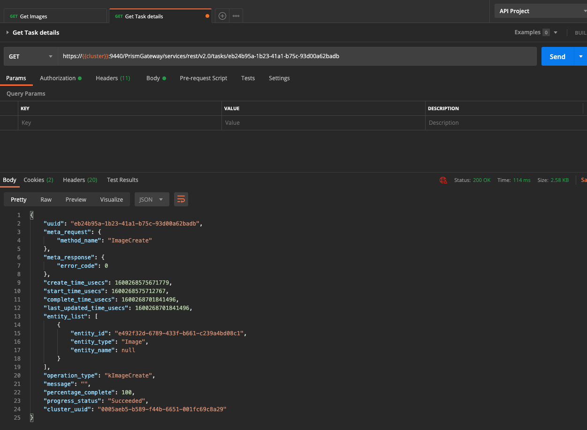

After a clean up in PRISM (she deleted all the items that have been created by the script), she reruns the script to see the full process for all steps... All steps are run nicely and the network, storage container and image have been created/uploaded.

Great now the next phase... Create a VM using an API call.

Create a VM
^^^^^^^^^^^

The creation of the VM has some more steps to consider then the previous ones. As she remembered from the creation of the VM using Postman, during the capturing of the API call from PRISM, there are dependencies on two items:

#. As the VM should be cloned from an existing drive, the UUID of that drive is needed
#. For the network connection, she needs to know the UUID of the network to which the VM should be connected to (**vm_nics** part in the below JSON for the creation of the VM)
   
   .. code-block:: json

   
    {
        "name":"Ubuntu Server",
        "memory_mb":1024,
        "num_vcpus":1,
        "description":"Ubuntu Server",
        "num_cores_per_vcpu":1,
        "timezone":"UTC",
        "boot":{
            "uefi_boot":false,
            "boot_device_order":[
                "CDROM","DISK","NIC"
                ]
            },
        "vm_disks":[
            {
                "is_cdrom":true,
                "is_empty":true,
                "disk_address":{
                    "device_bus":"ide",
                    "device_index":0
                }
            },
            {
                "is_cdrom":false,
                "disk_address":{
                    "device_bus":"scsi",
                    "device_index":0
                },
                "vm_disk_clone":{
                    "disk_address":{
                        "vmdisk_uuid":"ac19ac30-06d8-4b5b-84b5-10da312cfd31"
                    }
                }
            }
        ],
        "vm_nics":[
            {
                "network_uuid":"342030bd-5a2e-419e-b539-f6c4cc30e8c9",
                "is_connected":true
            }
        ],
        "hypervisor_type":"ACROPOLIS",
        "vm_features":{
            "AGENT_VM":false
        }
    }

Now the first part, the uuid of the image that needs to be used for the cloning.
To make sure she uses the correct uuid, she opens PRISM and captures the creation of the VM, as she has done earlier, to see what the latest UUID is that is going to be used. Then she tries to get a relationship between the UUID captured and the correct UUID of the image. That way she knows what UUID to use where...

In the captured data (the JSON payload that is being send to the environment), she sees the following:

.. code-block:: json

    {
      "name":"Ubuntu Server",
      "memory_mb":1024,
      "num_vcpus":1,
      "description":"",
      "num_cores_per_vcpu":1,
      "timezone":"UTC",
      "boot":{
        "uefi_boot":false,
        "boot_device_order":["CDROM","DISK","NIC"]
      },
      "vm_disks":[{
        "is_cdrom":true,
        "is_empty":true,
        "disk_address":{
          "device_bus":"ide",
          "device_index":0
          }
        },{
          "is_cdrom":false,
          "disk_address":{
            "device_bus":"scsi",
            "device_index":0,
            "vmdisk_uuid":"4d7ee86b-6106-4f84-a100-3275d780cb5f"
          },
          "vm_disk_clone":{
            "disk_address":{
              "vmdisk_uuid":"454d4af9-841b-473a-ad34-a96349052aff"
          },
          "minimum_size":2362232013
        }
      }],
      "vm_nics":[{
        "network_uuid":"38dfb507-788a-4d8f-8aef-319bbf01b002",
        "is_connected":true
      }],
      "hypervisor_type":"ACROPOLIS",
      "vm_features":{"AGENT_VM":false}
    }

She also sees that the environment returns a task_uuid, as she has already used that for the upload, she can reuse that part... 

Now that she knows the UUID of the disk that is being used: **4d7ee86b-6106-4f84-a100-3275d780cb5f**, she opens Postman and the **Get Images** tab and hits the Send button. She sees the result of the Get Image API Call and finds the same uuid under **vm_disk_id**.

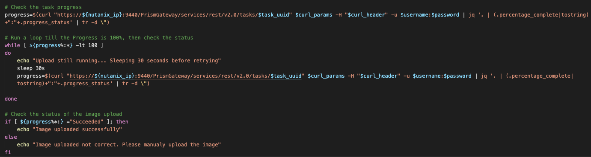

Now she needs to get the vm_disk_id in a variable in her script.
She follows these steps to get to the end:

#. In VC in the terminal window she creates a cURL command to simulate the Postman API Call.
#. Add jq to get the correct data needed by using filtering (select)
#. Remove the “ symbols from the jq returned values
#. Add the result into a variable.

The command she ends up with looks like this: 

.. code-block:: bash

    curl  https://192.168.1.42:9440/PrismGateway/services/rest/v2.0/images --insecure --silent -H 'Content-Type: application/json' -u admin:Nutanix/12 | jq '.entities[] | select (.name==”Ubuntu 18.04.2 LTS-Disk” | .vm_disk_id)' | tr -d \”

The command returns the same UUID for the disk as she saw in the Postman tab.

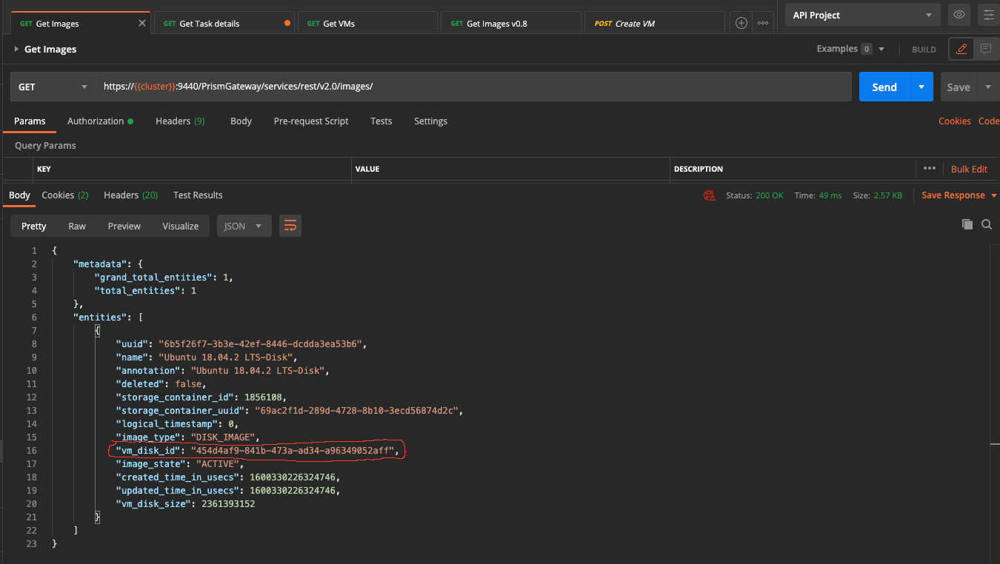

Now populating a variable is easy. She adds **vm_disk_id=$( to the command and ends with )**. That way she has the returned value assigned to a variable.

.. code-block:: bash

    vm_disk_id=$(curl  https://192.168.1.42:9440/PrismGateway/services/rest/v2.0/images --insecure --silent -H 'Content-Type: application/json' -u admin:Nutanix/12 | jq '.entities[] | select (.name==”Ubuntu 18.04.2 LTS-Disk” | .vm_disk_id)' | tr -d \”)

For the second part the network uuid, as the script is creating the network, all good. The script creates the command and the environment returns that into a variable. But what if the network already exists? The script is bypassing the creation of the network and therefore doesn’t have the UUID. Joan has to create a routine, almost like the **vm_disk_id** to get the uuid of the network.

She creates the following line in her script to grab the network uuid.

.. code-block:: bash

    net_uuid=$(curl  https://192.168.1.42:9440/PrismGateway/services/rest/v2.0/networks --insecure --silent -H 'Content-Type: application/json' -u admin:Nutanix/12 | jq '.entities[] | select (.name==”api-call-proj” | .uuid)' | tr -d \”)

Now that she has the uuid of the disk and the uuid of the network, she copies the payload from Postman, the Create VM tab, and pastes it into her script. As the two uuids have been assigned to variables, she puts them into the payload at the correct location.

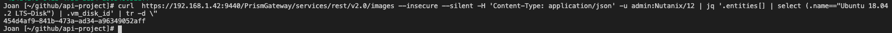

She creates the full cURL command in the script and runs the script. It should create the VM as the rest is already in the environment. The sequence is working, all items in the script are created or skipped on existence in the environment. 

Use of Functions
****************

Now as the VM create API Call also returns a task_uuid, she is going to use the wait loop from the upload and change that into a function. That way it can be used often and it saves duplicate lines of code. Her function looks like this:

.. code-block:: bash

    function task_progress (){
    # Check the task progress
    progress=$(curl "https://${nutanix_ip}:9440/PrismGateway/services/rest/v2.0/tasks/$task_uuid" $curl_params -H "$curl_header" -u $username:$password | jq '. | (.percentage_complete|tostring)+":"+.progress_status' | tr -d \")
    
    # Run a loop till the Progress is 100%, then check the status
    while [ ${progress%:*} -lt 100 ]
    do
        echo "Task still running. Process is at ${progress%:*}%.. Sleeping 30 seconds before retrying"
        sleep 30s
        progress=$(curl "https://${nutanix_ip}:9440/PrismGateway/services/rest/v2.0/tasks/$task_uuid" $curl_params -H "$curl_header" -u $username:$password | jq '. | (.percentage_complete|tostring)+":"+.progress_status' | tr -d \")       
    done
    }

She calls the function via **task_progress $task_uuid** during the upload and the creation phase of the script. 
A second run of the script is showing that all steps are being skipped as the network, storage container, image and VM are already on the environment.

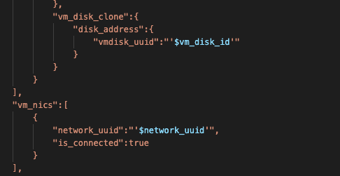

------

Conclusion of first steps of automation
^^^^^^^^^^^^^^^^^^^^^^^^^^^^^^^^^^^^^^^
So far she is able using API Calls programmatically to create:
- Storage container
- Network
- Upload of image
- VM which uses the earlier created Image and network

She learnt:

- to use DevTools that are available in modern browsers
- how to use Postman for capturing, sending API Call, capture the responses, create collections and save the API requests she created.
- to use Visual Code, to create and test the script without changing the UIs with respect to Terminal sessions

All of this she has done in just 4 days. From scratch to getting quite some automation done using bash. Now she still has some items open on her project:

#. How to manipulate VMs 
    
   a. Power options: start, stop, pause and resume
   b. Assign CDRom and boot from them
   c. Dis- and connect a nic

#. Upload more than just one image with different types
#. Create more than just one VM, approx. 10.
#. Fun one: After the VM has started, start multiple Console screens on the Laptop she is running so she sees the interfaces

Let’s call it a day... See you all tomorrow.....
