.. _day5:

---------------------------
Day 5 - Advanced automation
---------------------------

Now the last part for her project has started. Joan has set herself these items

#. How to manipulate VMs 
   
   #. Power options: start, stop, pause and resume
   #. Assign CDRom and boot from them
   #. Dis- and connect a nic
   #. Add and remove a nic

#. Upload more than just one image with different types
#. Create more than just one VM, approx. 10.
#. Fun one: After the VM has started, start multiple Console screens on the Laptop she is running so she sees the interfaces

How to manipulate a VM 
^^^^^^^^^^^^^^^^^^^^^^

For this item she wants to get the Power on and Power Off commands as well as assigning a ISO image to the VM and dis- and connect a NIC.

VM Power on
***********

Joan opens her DevTool, after she logged into her Test CE PRISM interface.
She heads over to VMs and selects her earlier built VM and selects Poweron and grabs the API Call.. The API Call URL seems to have the UUID of the VM in it.

.. code-block:: bash

    https://192.168.1.42:9440/PrismGateway/services/rest/v2.0/vms/7de8bee0-2c28-4691-9c9c-160a1d32ba79/set_power_state

Method being used is **POST**

With a Post payload of **{"transition":"on"}**. The command then returns a task uuid.

VM Power off
************

For the Power Off Joan uses the same method as she used for the Power On. The URL for the API Call is the same as the Power on command, but as she selected Guest Shutdown, the Payload has changed in **{"transition":"acpi_shutdown"}**. To have a hard shutdown the payload needs to be changed into **{"transition":"off"}**. Both commands return a task uuid.

Assign ISO to CDROM with existing VM
************************************

Joan uploads an ISO image to the cluster using the PRISM UI.  She uses a mini.iso image of the Ubuntu 18.04 server. She uses the URL http://archive.ubuntu.com/ubuntu/dists/bionic/main/installer-amd64/current/images/netboot/mini.iso.
She adds the ISO image to the VM as the CDROM and sees that there is an UPDATE method being used to assign the ISO to the VM. The URL of the API Call is

.. code-block:: bash

    https://192.168.1.42:9440/PrismGateway/services/rest/v2.0/vms/7de8bee0-2c28-4691-9c9c-160a1d32ba79/disks/update

Method: **PUT**

The payload is

.. code-block:: json

    {
      "vm_disks":[{
        "disk_address":{
          "device_index":0,
          "device_bus":"ide"
        },
        "flash_mode_enabled":false,
        "is_cdrom":true,
        "is_empty":false,
        "vm_disk_clone":{
          "disk_address":{
            "vmdisk_uuid":"918cd69f-ab30-4e3e-b1a5-8a6565da4748"
          },
          "minimum_size":75161928
        }
        }]
    }

She then hits the **Save** Button and grabs the API Calls
The system is calling 

.. code-block:: bash

    https://192.168.1.42:9440/PrismGateway/services/rest/v2.0/vms/7de8bee0-2c28-4691-9c9c-160a1d32ba79?include_vm_disk_config=true&include_vm_nic_config=true&includeVMDiskSizes=true&includeAddressAssignments=true

Method: **PUT**

With payload of

.. code-block:: json

    {
      "name":"Test-API",
      "memory_mb":1024,
      "num_vcpus":1,
      "description":"Test-API",
      "num_cores_per_vcpu":1,
      "timezone":"UTC",
      "boot":{
        "uefi_boot":false,
        "boot_device_order":["CDROM","DISK","NIC"]
      },
      "machine_type":"pc",
      "vm_features":{
        "FLASH_MODE":false,
        "AGENT_VM":false
      }
    }

All the actions above return a task uuid as a result of the API call.

Dis- and connect a NIC
**********************

For the disconnecting and connecting of the NIC she grabs the API’s URL/Payload and return codes

For Disconnect
++++++++++++++

- URL: **https://192.168.1.42:9440/PrismGateway/services/rest/v2.0/vms/7de8bee0-2c28-4691-9c9c-160a1d32ba79/nics/50%3A6b%3A8d%3A89%3A90%3Ae9**
- Method: **PUT**
- Payload: **{"nic_spec":{"network_uuid":"38dfb507-788a-4d8f-8aef-319bbf01b002","requested_ip_address":"10.10.200.189","is_connected":false,"vlan_id":"333"},"nic_id":"50-6b-8d-89-90-e9"}**
- Result: **Task uuid**

For Connect
+++++++++++

- URL: **https://192.168.1.42:9440/PrismGateway/services/rest/v2.0/vms/7de8bee0-2c28-4691-9c9c-160a1d32ba79/nics/50%3A6b%3A8d%3A89%3A90%3Ae9**
- Method: **PUT**
- Payload: **{"nic_spec":{"network_uuid":"38dfb507-788a-4d8f-8aef-319bbf01b002","requested_ip_address":"10.10.200.189","is_connected":true,"vlan_id":"333"},"nic_id":"50-6b-8d-89-90-e9"}**
- Result: **Task uuid**

Add a nic
+++++++++

- URL: **https://192.168.1.42:9440/PrismGateway/services/rest/v2.0/vms/7de8bee0-2c28-4691-9c9c-160a1d32ba79/nics**
- Method: **POST**
- Payload: **{"spec_list":[{"network_uuid":"38dfb507-788a-4d8f-8aef-319bbf01b002","is_connected":true,"vlan_id":"333"}]}**
- Result: **Task uuid**

Delete a nic
++++++++++++

- URL: **https://192.168.1.42:9440/PrismGateway/services/rest/v2.0/vms/7de8bee0-2c28-4691-9c9c-160a1d32ba79/nics/50%3A6b%3A8d%3Af9%3A4b%3Aea**
- Method: **DELETE**
- Payload: **NONE**
- Result:	**Task uuid**

Now for the settings she sees a few parameters/UUIDs that are VM and nic/network specific:

- The UUID of the VM for the update
- NIC MAC Address
- Network UUID of the NIC

Create a VM with new nic and CDROM
^^^^^^^^^^^^^^^^^^^^^^^^^^^^^^^^^^

Now that she has an idea on how to manipulate an existing VM, she creates a new VM which has a NIC but also a CDROM assigned to an ISO image as well as a new harddisk of 20GB. She captures the API calls:

- URL: **https://192.168.1.42:9440/PrismGateway/services/rest/v2.0/vms?include_vm_disk_config=true&include_vm_nic_config=true**
- METHOD: **POST**
- Payload: 

  .. code-block:: json
  
        {
            "name":"Test",
            "memory_mb":1024,
            "num_vcpus":1,"description":"",
            "num_cores_per_vcpu":1,
            "timezone":"UTC",
            "boot":{
              "uefi_boot":false,
              "boot_device_order":["CDROM","DISK","NIC"]},
              "vm_disks":[{
                "is_cdrom":true,
                "is_empty":false,
                "disk_address":{
                  "device_bus":"ide",
                  "device_index":0,
                  "vmdisk_uuid":"e00be7d0-5065-49b6-ad8c-daedf9d84aca"
                },
                "vm_disk_clone":{
                  "disk_address":{
                    "vmdisk_uuid":"918cd69f-ab30-4e3e-b1a5-8a6565da4748"
                  },
                  "minimum_size":75161928
                }
              },
              {
                "is_cdrom":false,
                "disk_address":{
                  "device_bus":"scsi",
                  "device_index":0
                },
                "vm_disk_create":{
                  "storage_container_uuid":"9c5b8994-b636-48cb-8817-bbe8a7f2eca5",
                  "size":21474836480
                }
              }],
              "vm_nics":[{
                "network_uuid":"38dfb507-788a-4d8f-8aef-319bbf01b002",
                "is_connected":true
              }],
              "hypervisor_type":"ACROPOLIS",
              "vm_features":{"AGENT_VM":false}
        }

- Result: **Task uuid**

She uses Postman to create a new VM, based on the information she captured and leaves the vmdisk_uuid of the new CDROM (in bold) out of the Payload and hits **Send**. The system has accepted the payload and returns a **task uuid**. 

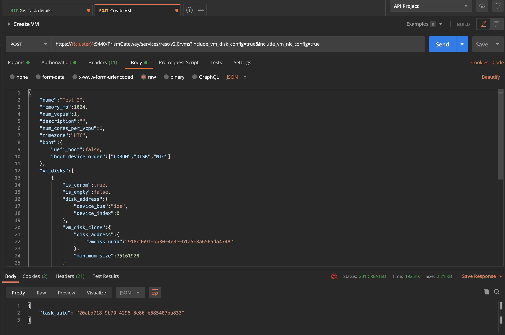

After a few seconds she sees that the VM has been created.

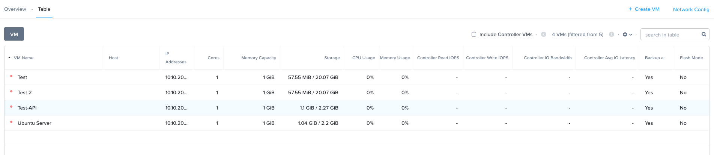

She uses the earlier created API Call in Postman to start the VM. She grabs the UUID from the VM by getting a list of the VMs and searches for the name and the corresponding UUID of the VM.

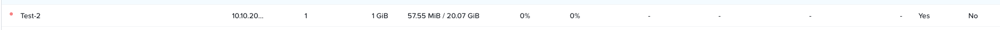

And copies that UUID in the URL for powering on the VM....

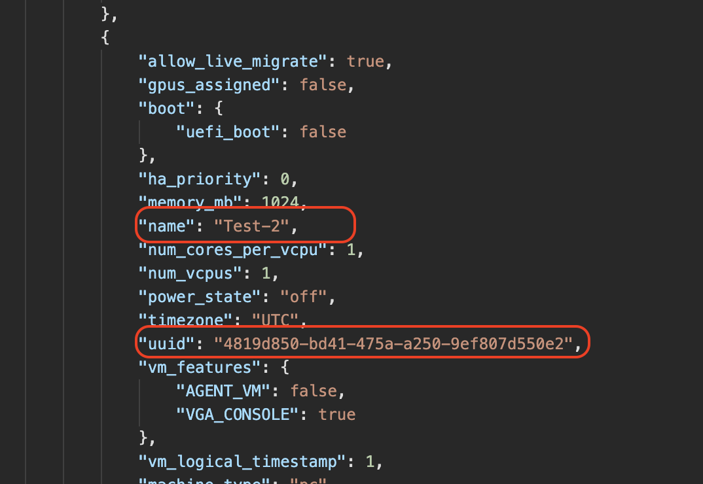

And hits the **Send** button... The API Call returns a task uuid, just like she expected based on her earlier captured calls. The VM is powered on and PRISM is showing this...

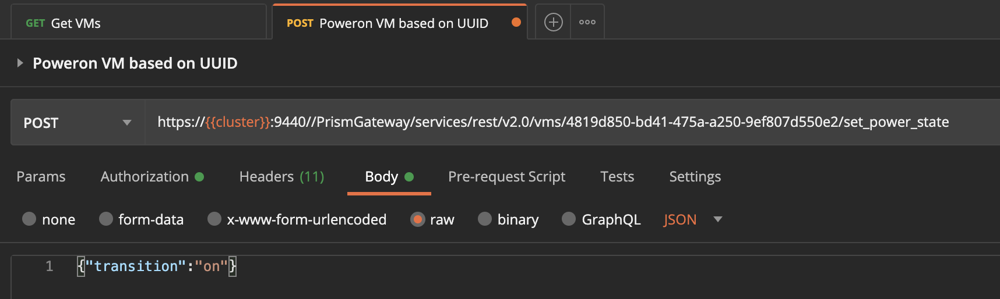

She then launches the console and sees that the URL holds the UUID of the VM *(4819d850-bd41-475a-a250-9ef807d550e2)*...

.. code-block:: bash 
    
    https://192.168.1.42:9440/console/lib/noVNC/vnc_auto.html?path=vnc/vm/4819d850-bd41-475a-a250-9ef807d550e2/proxy&title=Test-2&uuid=4819d850-bd41-475a-a250-9ef807d550e2&uhura=true&attached=false&noV1Access=false&useV3=true

“Ok that I can use for the fun item on my list...”. In the console window she sees that the VM has started from the ISO image as it is showing the boot of a mini installation of Ubuntu. So that also worked... Now to get everything, including the other items in a script...

Adding all into a script...
^^^^^^^^^^^^^^^^^^^^^^^^^^^

Now that Joan has all the needed captures for her project, she is going to cleant the system and make changes to her script. The end game is that the script can:

#. Create a network
#. Create a storage container
#. Upload multiple ISO and Disk images
#. Create multiple Vms using the created storage containers, network and upload disk and/or ISO image
#. Power them on
#. Fun: Open consoles of these VMs she created.

As she already has the create network and storage container in her script, she needs to make some changes to the multiple upload and multiple creation of VMs.

She decides to use a combination of arrays and a loop construct to get that working. As she already has some stuff in the cluster, she is going to use different naming so they don’t intervene with the already created network, storage containers, images and VMs.

Upload Multiple images
^^^^^^^^^^^^^^^^^^^^^^

Joan knows that her organisation has a webserver where the images are available. The Ubuntu server images are old, so for those she decides to pull them from the internet. She is just going to use those images as they are easy to pull and for a test she decides just to go for the Linux Ubuntu O/S. if it works for Linux, it’ll work for Windows. Just as long as they are sysprepped. The adding of the custom Cloudinit/Syspre.xml file is something I’m gonna do later....

She wants to upload the following images of the Ubuntu Linux Distribution:

#. Ubuntu mini OS of 18.04 LTS
#. Ubuntu server 18.04 LTS ISO
#. Ubuntu server disk image of 18.04 LTS

To get this working she uses arrays, one array for the images, one array for the URLs where to get to images and one array for the type of the file (DISK or ISO). She then ties all together using a loop construct. After she has made the changes and saved the file she runs the script. She expects the following:

#. Network already exists message, as she hasn’t deleted the network
#. Storage container Already exists message (Images), as she hasn’t deleted this container
#. Three times a task that is running, due to the upload of the file
#. In PRISM the images should be available.
#. VM Already exists message, as she hasn’t deleted the VM or changed the script.

The script is returning exactly what she expected.

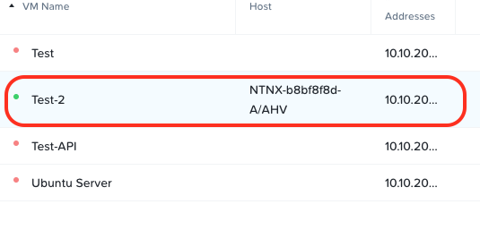

Also PRISM is showing the images as to be ready for use. They are mentioning ACTIVE

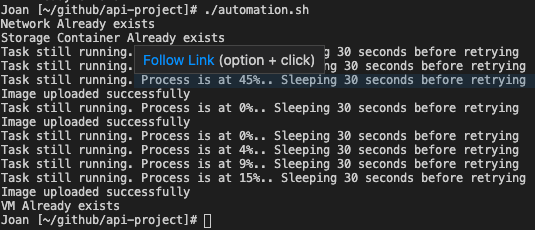

Now that she has the images, she focuses on the creation of multiple VMs using the IMages she created.

Create multiple VMs
^^^^^^^^^^^^^^^^^^^

For this part of the project, she wants to have VMs that :

- 3x VMs, using the network, connected, and have the uploaded Ubuntu disk image as their drive (cloned) and an empty CDROM
- 3x VMs, using the network, connected that have a new empty harddisk and have the MINI ISO assigned to the CDROM
- 3x VMs, using the network, disconnected, have a new empty harddisk and have the Ubuntu server ISO assigned to the CDROM.

Get the needed UUIDs
********************

As all VMs need to get ISO or DISK images as well as new disks she needs to get first all the UUIDs of the needed images. Then as all VMs get network connections, she also needs to get the network UUID. Some of the VMs she wants to create have new disk, so she needs the UUID of the Storage Container she wants to use.

She gets the the UUIDs using the following steps:

#. Network UUID, as she already has that covered, she wants to use the newly created api-proj-api network. She uses the following api call, jq filtering and assigns a variable:

   .. code-block: bash

    network_uuid=$(curl "https://${nutanix_ip}:9440/PrismGateway/services/rest/v2.0/networks" $curl_params -H "$curl_header" -u $username:$password | jq '.entities[] | select (.name=="api-call-proj") | .uuid' | tr -d \")

#. For UUID of the storage container Images she uses the following API Call and filtering via jq and assigns it to a variable

   .. code-block: bash

    str_cntr=$(curl "https://${nutanix_ip}:9440/PrismGateway/services/rest/v2.0/storage_containers/" $curl_params -H "$curl_header" -u $username:$password | jq '.entities[] | select (.name=="Images") | .storage_container_uuid' | tr -d \")

#. The disk UUID are a bit more difficult, but she solves it by the following steps:

   a. Create an array with the needed UUIDs that have been uploaded earlier.
   b. Via a loop, use the items from the image array to use the image name as a filter in a jq routine.
   c. The full call looks like:

      .. code-block:: bash

        # Create empty uuid array
        image_uuid=()

        for image in "${images_upload_anno[@]}"
        do
            # Get the disk IDs of the images uploaded earlier and put them in an array
            image_uuid+=($(curl "https://${nutanix_ip}:9440/PrismGateway/services/rest/v2.0/images" $curl_params -H "$curl_header" -u $username:$password | \
                            jq --arg name "$image" '.entities[] | select (.name==$name) | .vm_disk_id' | tr -d \"))
        done

Create Ubuntu VMs
*****************

For the creation of the VMs, Joan is using a couple of arrays and selective parameters based on the name of the VM. As she controls everything, she can decide the best way to have the VMs being built.

She follows the next steps to create the VMs:

#. Create an array of names to be used for the three different type of VMs
#. Create a loop for the array
#. Based on the name of the type of the VM
#. Set the disk image id, if the VM needs the have a cloned harddisk
#. Set the cdrom image id, if the VM needs to have an ISO assigned to the CDROM
#. Set if a parameter for the network if needed
#. Create a loop, in the loop for the array of VM types, for 1 to 3
#. Create the json payload for the VM creation using the set parameters
#. Run the API Call to create the VM
#. Use the return of the API call to check the progress and status of the creation of the VM
#. Repeat steps 5-7 for the next number till the loop is done
#. Repeat steps 4-7 for the next type of VM

Below flowchart shows at a high level what the steps have been.

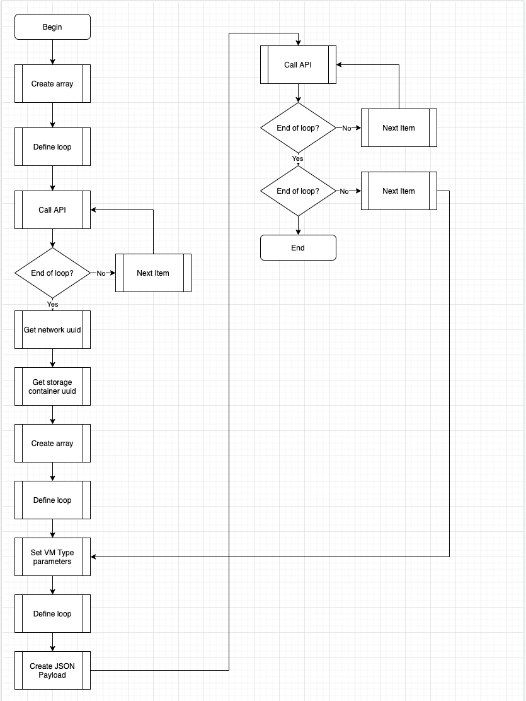

Power-on created VMs
********************

For the script to be able to poweron the created VMs, it needs to have the UUID of these VMs.
Joan uses some arrays and loops to get the correct uuids. Roughly the steps are:

#. Define two arrays
#. Create a loop that enumerates through the three types of VMs
#. Create a loop in the loop of step 2 from 1 till 3
#. Use the create VM name (machine type and 1,2 or 3) as a filter in the jq part of the api call and assign the result to an array from step 1
   
   .. code-block:: bash

    vm_uuid+=($(curl $curl_params -H "$curl_header" -u $username:$password https://${nutanix_ip}:9440/api/nutanix/v2.0/vms/ | jq --arg vmname "$vm_name_jq" '.entities[] | select (.name==$vmname) | .uuid' | tr -d \"))

#. If second loop not ready, repeat step 4 else done
#. If first loop not ready, repeat steps 3-5 else done
#. Create a loop which uses the created array in step 4
#. Call the API with the UUID from the used array
#. Assign returned result of the API Call to an variable
   
   .. code-block:: bash
    
    task_uuid=$(curl --request POST $curl_params -H "$curl_header" -u $username:$password https://${nutanix_ip}:9440/PrismGateway/services/rest/v2.0/vms/$vm_name_arry/set_power_state -d '{"transition":"on"}' | jq '.task_uuid' | tr -d \")

#. Use the variable to check progress
#. If loop not ready, repeat steps 8-11 with the next uuid, else done

The above steps in a flowchart are shown below.

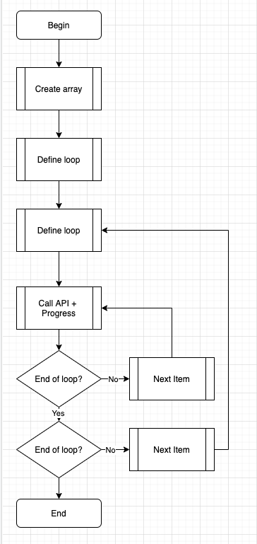

Fun: Open all consoles of the created VMs
*****************************************

Last part of her project in automation is to see if she is capable of having all consoles open of the VMs she just created.
As she has already captured a URl of such an interface, she has to manipulate the information in the URL and a way to call Chrome from the command line on her Mac.
The URL for the Console looks like this: 

.. code-block:: bash

    https://192.168.1.42:9440/console/lib/noVNC/vnc_auto.html?path=vnc/vm/7b9314da-44c7-4d25-b496-c040ac5a4d56/proxy&title=Test&uuid=7b9314da-44c7-4d25-b496-c040ac5a4d56&uhura=true&attached=false&noV1Access=false&useV3=true

In the URL are variables she recognises.. UUID of the VM and the Name of the VM.

She is running the following steps to get it working:
#. Define two arrays
#. Create via a loop in a loop the VM names she needs for the Title in the URL
#. Create a new loop and run through the items in the array of vm uuids used earlier.
#. Run the command to open the console of the VM using Chrome in its own window, no tabs
#. Repeat step 4 till the end.

The flowchart below shows the steps.

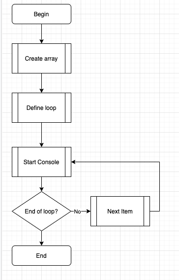

End result
^^^^^^^^^^

Now that she has all parts of her project ready and scripted, she is starting the script to see what happens...
The script has ran:

#. Skip network creation as it already existed
#. Skip Storage Container Creation as it already existed
#. Skip images upload as they already existed on the cluster
#. Created 9 VMs
#. Powered on the 9 VMs
#. Opened 9 Chrome Windows of the consoles of the VMs.

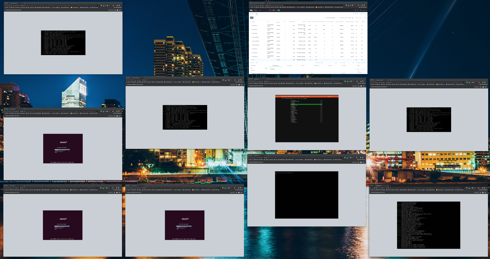

As the script is working in the current test environment, she now wants to test with a clean system to see if all works as expected. She cleans out the system by deleting the VMS, Images, Storage Container and the Network.
Joan makes a small change to the network. She changes the vlan to vlan 0 so the VMs should be able to go out to the internet. She then runs the script to see if everything works.....
During the run of the script she gets an error on one of the images. She checks and sees that the URL she used doesn’t exist anymore. She makes the changes to the URL, cleans the system again and reruns the script.
It has worked! All items have been created as well the consoles that have been opened in Chrome.

Done for this project.........

The Full Flowchart of the script looks like

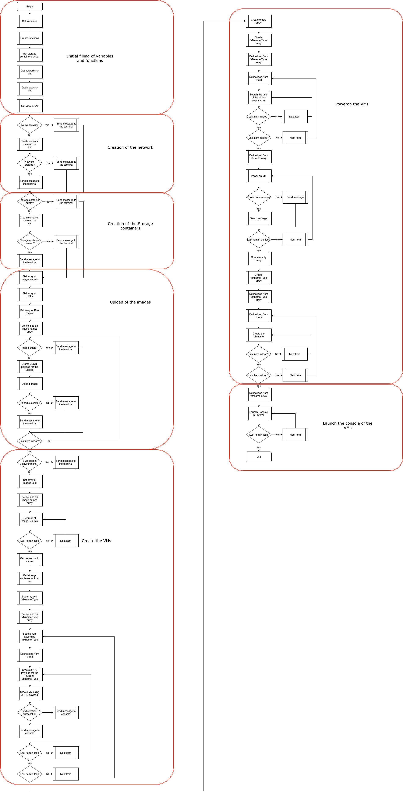

The script it self in its whole looks like:

.. code-block:: bash

    #!/bin/bash
    ########################################################
    # Script for automating a few steps in Nutanix
    # 1. Create a storage container
    # 2. Create a network
    # 3. Upload images using an URL
    # 4. Create a VM using the earlier created/uploaded items
    # 5. Power on the VMs
    # 6. Show the console of the created VMs in Chrome (new Window)
    ########################################################

    ########################################################
    # Variables
    ########################################################
    nutanix_ip="192.168.1.42"
    username="admin"
    password="Nutanix/12"
    curl_params="--insecure --silent"
    curl_header='Content-Type: application/json'

    ########################################################
    # Functions
    ########################################################
    # Wait loop till a task is done. Only used for the tasks that take longer than 30 seconds, or have a task id
    function task_progress (){
    tsk_uuid=$1
    wait_time=$2

    # Check the task progress
    progress=$(curl "https://${nutanix_ip}:9440/PrismGateway/services/rest/v2.0/tasks/$tsk_uuid" $curl_params -H "$curl_header" -u $username:$password | jq '. | (.percentage_complete|tostring)+":"+.progress_status' | tr -d \")

    # Run a loop till the Progress is 100%, then check the status
    while [ ${progress%:*} -lt 100 ]
    do
        echo "Task still running. Process is at ${progress%:*}%.. Sleeping $wait_time seconds before retrying"
        sleep $wait_time
        progress=$(curl "https://${nutanix_ip}:9440/PrismGateway/services/rest/v2.0/tasks/$tsk_uuid" $curl_params -H "$curl_header" -u $username:$password | jq '. | (.percentage_complete|tostring)+":"+.progress_status' | tr -d \")       
    done

    }

    function payload(){
    # Create the payload needed for the VM
    vm_name_fnct=$1
    network=$2
    str_container=$3
    disk_vm_id=$4
    cdrom_id=$5

    if [ $network = "Yes" ]
    then
        nic_connect=true
    else
        nic_connect=false
    fi

    # Start the Payload creation
    payload_vm='{
        "name":"'$vm_name_fnct'",
        "memory_mb":1024,
        "num_vcpus":1,
        "description":"'$vm_name_fnct'",
        "num_cores_per_vcpu":1,
        "timezone":"UTC",
        "boot":{
            "uefi_boot":false,
            "boot_device_order":[
                "CDROM","DISK","NIC"
                ]
            },
        "vm_disks":[
            {
                "is_cdrom":true,'
    
    # Check if we have asked for a CDROM
    if [[ "$cdrom_id" != "NULL" ]]
    then
        payload_vm=$payload_vm'           
                "is_empty":false,
                "disk_address":{
                    "device_bus":"ide",
                    "device_index":0
                },
                "vm_disk_clone":{
                    "disk_address":{
                        "vmdisk_uuid":"'$cdrom_id'"
                    }
                }
            },'
        
    else
        payload_vm=$payload_vm'           
                "is_empty":true,
                "disk_address":{
                    "device_bus":"ide",
                    "device_index":0
                }
            },'
    fi

    payload_vm=$payload_vm'
            {
                "is_cdrom":false,
                "disk_address":{
                    "device_bus":"scsi",
                    "device_index":0
                },'
    
    # See if we asked to add a cloned disk
    if [[ "$disk_vm_id" != "NULL" ]]
    then           
        payload_vm=$payload_vm'
                "vm_disk_clone":{
                    "disk_address":{
                        "vmdisk_uuid":"'$disk_vm_id'"
                    }
                }'
    else
        payload_vm=$payload_vm'
                "vm_disk_create":{
                    "storage_container_uuid":"'$str_container'",
                    "size":21474836480
                }'
    fi

    # Create the last part of the Payload for the VM
    payload_vm=$payload_vm'        }
        ],
        "vm_nics":[
            {
                "network_uuid":"'$network_uuid'",
                "is_connected":'$nic_connect'
            }
        ],
        "hypervisor_type":"ACROPOLIS",
        "vm_features":{
            "AGENT_VM":false
        }
    }'
    }

    ########################################################
    # Get the storage containers on the system and store them in an array
    st_cntrs=($(curl $curl_params -H "$curl_header" -u $username:$password https://${nutanix_ip}:9440/PrismGateway/services/rest/v2.0/storage_containers/ | jq '.entities[].name' | tr -d \"))

    # Get the networks in the environment
    networks=($(curl $curl_params -H "$curl_header" -u $username:$password https://${nutanix_ip}:9440/PrismGateway/services/rest/v2.0/networks/ | jq '.entities[].name' | tr -d \"))

    # Get the images from the environment
    images=($(curl $curl_params -H "$curl_header" -u $username:$password https://${nutanix_ip}:9440/PrismGateway/services/rest/v2.0/images/ | jq '.entities[].name' | tr -d \"))

    # Get the vms in the environment
    vms=($(curl $curl_params -H "$curl_header" -u $username:$password https://${nutanix_ip}:9440/api/nutanix/v2.0/vms/ | jq '.entities[].name' | tr -d \"))
    ########################################################

    ########################################################
    # Network there or not to be created
    ########################################################
    if [[ " ${networks[@]} " =~ " api-call-proj " ]]; then # If the network doesn't exist yet, create it
    echo "Network Already exists"
    else
    # Create network
    payload='{
    "annotation": "API Calls Project",
    "ip_config": {
        "default_gateway": "10.10.200.254",
        "dhcp_options": {
        "domain_name": "api-call-proj.local",
        "domain_name_servers": "8.8.8.8",
        "domain_search": "api-call-proj.local"
        },
        "dhcp_server_address": "10.10.200.253",
        "network_address": "10.10.200.0",
        "pool": [
        {
            "range": "10.10.200.100 10.10.200.200"
        }
        ],
        "prefix_length": 24
    },
    "logical_timestamp": 0,
    "name": "api-call-proj",
    "vlan_id": 0
    }'

    net_uuid=$(curl --request POST "https://${nutanix_ip}:9440/PrismGateway/services/rest/v2.0/networks/" -d "$payload" $curl_params -H "$curl_header" -u $username:$password | jq '.network_uuid' | tr -d \")
    if [ -z $net_uuid ]; then
        echo "Network has not been created."
    else
        echo "Network has been created."
    fi
    fi

    ########################################################
    # If the storage container not there, create it
    ########################################################
    if [[ " ${st_cntrs[@]} " =~ " Images " ]]; then # If the Images container isn't there, create it
    echo "Storage Container Already exists"
    else
    # Create storage containers
    payload_strcntr='{
    "advertised_capacity": 0,
    "compression_delay_in_secs": 0,
    "compression_enabled": true,
    "finger_print_on_write": "NONE",
    "name": "Images",
    "nfs_whitelist_inherited": true,
    "on_disk_dedup": "OFF",
    "vstore_name_list": [
        "Images"
    ]
    }'

    str_uuid=$(curl --request POST "https://${nutanix_ip}:9440/PrismGateway/services/rest/v2.0/storage_containers/" -d "$payload_strcntr" $curl_params -H "$curl_header" -u $username:$password | jq '.value')
    if [ $str_uuid = "true" ]; then
        echo "Storage Container has been created."
    else
        echo "Storage Container has not been created."
    fi
    fi

    ########################################################
    # Create image if not there
    ########################################################

    images_upload_anno=("Ubuntu 18.04 LTS" \
                    "Ubuntu 18.04 LTS MINI" \
                    "Ubuntu 18.04 LTS Server")
    images_urls=("https://cloud-images.ubuntu.com/bionic/current/bionic-server-cloudimg-amd64.img" \
                "http://archive.ubuntu.com/ubuntu/dists/bionic/main/installer-amd64/current/images/netboot/mini.iso" \
                "https://releases.ubuntu.com/18.04.5/ubuntu-18.04.5-live-server-amd64.iso")
    images_type=("DISK" \
                "ISO" \
                "ISO")

    array_count=0

    for image in "${images_upload_anno[@]}"
    do

    if [[ " ${images[@]} " =~ " $image " ]]; then # if the image isn't there, create it
        echo "Image Already exists"
    else
        # Upload an image
        payload_image='{
        "name":"'$image'",
        "annotation":"'$image'",
        "image_type":"'${images_type[$array_count]}'_IMAGE",
        "image_import_spec":{
            "storage_container_name":"Images",
            "url":"'${images_urls[$array_count]}'"
        }
        }'
                
        task_uuid=$(curl --request POST "https://${nutanix_ip}:9440/PrismGateway/services/rest/v2.0/images" -d "$payload_image" $curl_params -H "$curl_header" -u $username:$password | jq '.task_uuid' | tr -d \")

        task_progress $task_uuid 30

        # Check the status of the image upload
        status=${progress#*:}
        if [ $status = "Succeeded" ]; then
            echo "Image uploaded successfully"
        else
            echo "Image uploaded not correct. Please manualy upload the image"
        fi
    fi
    array_count=$((array_count+1))
    done

    ########################################################
    # Create VMs
    ########################################################
    if [[ " ${vms[@]} " =~ " Server " ]]; then # if the image isn't there, create it
    echo "VM Already exists"
    else
    # Create empty uuid array
    image_uuid=()

    for image in "${images_upload_anno[@]}"
    do
        # Get the disk IDs of the images uploaded earlier and put them in an array
        image_uuid+=($(curl "https://${nutanix_ip}:9440/PrismGateway/services/rest/v2.0/images" $curl_params -H "$curl_header" -u $username:$password | \
                        jq --arg name "$image" '.entities[] | select (.name==$name) | .vm_disk_id' | tr -d \"))
    done

    # Get the network uuid
    network_uuid=$(curl "https://${nutanix_ip}:9440/PrismGateway/services/rest/v2.0/networks" $curl_params -H "$curl_header" -u $username:$password | jq '.entities[] | select (.name=="api-call-proj") | .uuid' | tr -d \")

    # Get the storage container uuid
    str_cntr=$(curl "https://${nutanix_ip}:9440/PrismGateway/services/rest/v2.0/storage_containers/" $curl_params -H "$curl_header" -u $username:$password | jq '.entities[] | select (.name=="Images") | .storage_container_uuid' | tr -d \")

    # Now run through the loop and create VMs based on arrays for network, UUIDs and Names
    #-----------------------------------------------------------
    # image_uuid for the disk images (Server(0), MINI(1), Disk(2))
    # network (yes,yes,no)
    # CDROM (Empty, assigned, assigned)
    #-----------------------------------------------------------
    # Name will be (Server-LTS-Disk-1 till 3) Disk UUID and no CDROM
    # Name will be (Server-mini-1 till 3) mini UUID (ISO)
    # Name will be (Server-LTS-1 till 3) server image UUID (DISK)
    
    array_names=("Server-LTS-Disk-" "Server-mini-" "Server-LTS-")

    for vm_name in "${array_names[@]}"
    do

        # Set the needed parameters based on the VM name
        case "$vm_name" in
            Server-LTS-Disk-)
                vm_disk_id=${image_uuid[0]}
                cd_disk_id="NULL"
                NETWORK="Yes"
                ;;

            Server-mini-)
                vm_disk_id="NULL"
                cd_disk_id=${image_uuid[1]}
                NETWORK="Yes"
                ;;
            
            Server-LTS-)
                vm_disk_id="NULL"
                cd_disk_id=${image_uuid[2]}
                NETWORK="No"
                ;;

            *)
                ;;
        esac

        for nr in 1 2 3
        do

            payload $vm_name$nr $NETWORK $str_cntr $vm_disk_id $cd_disk_id
            #echo $payload_vm | jq '.'
            task_uuid=$(curl --request POST "https://${nutanix_ip}:9440/PrismGateway/services/rest/v2.0/vms?include_vm_disk_config=true&include_vm_nic_config=true" -d "$payload_vm" $curl_params -H "$curl_header" -u $username:$password | jq '.task_uuid' | tr -d \")
    
            task_progress $task_uuid 1

            # Check the status of the VM Creation
            if [[ ${progress#*:} = "Succeeded" ]]
            then
                echo "VM $vm_name$nr has been created"
            else
                echo "VM $vm_name$nr has not been created"
            fi
        done
    done 
    fi

    ########################################################
    # Poweron VMs
    ########################################################
    # Get the UUIDs from the VMs we just created
    vm_uuid=()
    array_names=("Server-LTS-Disk-" "Server-mini-" "Server-LTS-")
    for vm_name in "${array_names[@]}"
    do
    for nr in 1 2 3
    do 
        vm_name_jq=$vm_name$nr
        vm_uuid+=($(curl $curl_params -H "$curl_header" -u $username:$password https://${nutanix_ip}:9440/api/nutanix/v2.0/vms/ | jq --arg vmname "$vm_name_jq" '.entities[] | select (.name==$vmname) | .uuid' | tr -d \"))
    done
    done

    # Send the VM the Power-on command
    for vm_name_arry in "${vm_uuid[@]}"
    do
    task_uuid=$(curl --request POST $curl_params -H "$curl_header" -u $username:$password https://${nutanix_ip}:9440/PrismGateway/services/rest/v2.0/vms/$vm_name_arry/set_power_state -d '{"transition":"on"}' | jq '.task_uuid' | tr -d \")
    task_progress $task_uuid 1
    # Check the status of the VM Creation
    if [[ ${progress#*:} = "Succeeded" ]]
    then
        echo "VM has been started"
    else
        echo "VM has not been started"
    fi
    done

    ########################################################
    # Open the Console of the created machines
    ########################################################
    array_names=("Server-LTS-Disk-" "Server-mini-" "Server-LTS-")
    vm_name_array=()
    for vm_name in "${array_names[@]}"
    do
    for nr in 1 2 3
    do 
        vm_name_array+=$vm_name$nr
    done
    done

    count=0
    for uuid in "${vm_uuid[@]}"
    do
    open --new -a "Google Chrome" --args --new-window  "https://${nutanix_ip}:9440/console/lib/noVNC/vnc_auto.html?path=vnc/vm/$uuid/proxy&title=${vm_name_array[$count]}&uuid=$uuid&uhura=true&attached=false&noV1Access=false&useV3=true"
    count=$((count+1))
    done

and can be downloaded `here <https://raw.githubusercontent.com/wessenstam/api-project/master/automation.sh>`